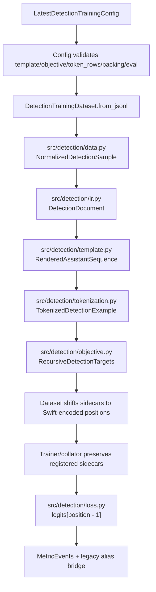
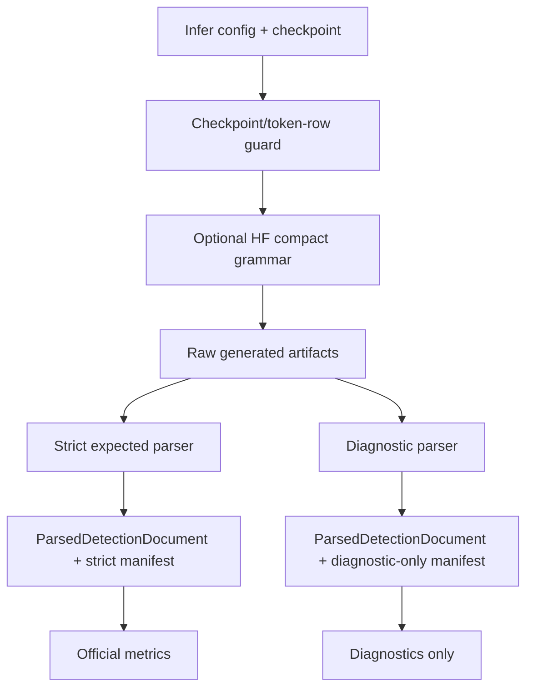

# Grounding Sequence IR Implementation Plan

Date: 2026-05-04

Worktree: `/data/CoordExp/.worktrees/compact-detection-sequence`

Branch: `codex/compact-detection-sequence`

Grounded snapshot: latest inspected branch state after:

| Commit | Meaning |
|---|---|
| `d94da8c` | `feat(infer): add compact-full decode guards` |
| `e78a174` | `feat(train): require compact token-row configs` |
| `393b66f` | `fix(optim): dedupe fallback offset params` |

Status: implementation plan only. Do not implement code from this plan unless the user explicitly starts the implementation phase.

## Goal

Normalize the current `codex/compact-detection-sequence` branch so standard JSON and compact detection templates share a typed hierarchy:

```text
source-normalized sample
  -> semantic DetectionDocument IR
  -> rendered assistant sequence with span events
  -> encoded sequence view with token roles and causal positions
  -> recursive objective sidecars
  -> loss and denominator-safe metrics
  -> strict parser/eval artifacts
```

The refactor should consolidate existing `src/detection/*` contracts rather than build a new parallel stack.

## Hard guardrails

| Guardrail | Requirement |
|---|---|
| Worktree only | All future implementation happens in `/data/CoordExp/.worktrees/compact-detection-sequence`, never root `main`. |
| No behavior drift | Preserve exact rendered bytes for `stage1_json_pretty` and `compact_full`. |
| No hidden parser relaxation | Strict metric eval remains strict; diagnostic parsers are diagnostic-only. |
| No metric alias drift | `coord_token_acc` and `coord_token_acc_top5` remain full-vocabulary coordinate-position metrics. |
| No packing/cache enablement | Latest compact recursive detection remains packing/cache disabled unless a separate sidecar-offset design is implemented. |
| No code during planning | This document is a plan/spec artifact; it is not implementation. |
| Config-first | Prefer config/schema/artifact contracts over new CLI flags. |
| Code owner boundaries | Keep semantic IR, rendering, tokenization, objective, loss, parser, inference guards, and artifacts separate. |

## Current baseline to preserve

| Surface | Current owner | Current role |
|---|---|---|
| Latest schema | `src/config/schema.py` | Validates latest sections, template/objective/token-row/packing/eval contracts. |
| Data normalization | `src/detection/data.py` | Raw row parsing and `NormalizedDetectionSample`. |
| Template render/parse | `src/detection/template.py` | `Stage1JsonPrettyTemplate`, `CompactFullTemplate`, rendered spans. |
| Common facade | `src/common/detection_sequence.py` | Public render/parse helpers and compact format constants. |
| Tokenization | `src/detection/tokenization.py` | Chat-template tokenization, labels, roles, masks. |
| Objective sidecars | `src/detection/objective.py` | Recursive targets, semantic roles, loss atoms. |
| Dataset alignment | `src/detection/dataset.py` | Prepared-to-Swift sidecar alignment and encoded position origin. |
| Loss | `src/detection/loss.py` | Recursive CE math over aligned targets. |
| Runtime wiring | `src/sft.py` | Latest dataset construction, failfast runtime checks, sidecar preservation. |
| Parser manifest | `src/detection/evaluation.py` | Strict vs diagnostic parser surfaces. |
| Inference decode guard | `src/infer/compact_grammar.py`, `src/infer/backends.py`, `src/infer/pipeline.py` | Optional HF-only compact-full grammar. |
| Checkpoint guard | `src/infer/checkpoints.py` | Compact adapter/token-row compatibility. |
| Artifact metadata | `src/infer/artifacts.py`, `src/infer/pipeline.py` | Resolved infer config, checkpoint, prompt, grammar, artifact metadata. |

## Refactor rules

1. Freeze current behavior before changing abstractions.
2. Add typed wrappers as adapter-only first.
3. Make span taxonomy explicit before building new metrics.
4. Make label/prediction position semantics explicit before touching loss integration.
5. Add parity tests before de-duplicating common/template compact logic.
6. Preserve dataset alignment as the only production bridge to actual Swift-encoded positions.
7. Add sidecar registry/model-input stripping before widening production integration.
8. Keep parser manifest and metric eligibility external to the IR.
9. Update docs only after code implements the logged keys or artifact fields.

## Proposed implementation sequence

### Task 0: Reconfirm branch-local baseline

Purpose: make sure the implementation session is operating on the intended worktree and latest branch snapshot.

Files:

| Path | Mode |
|---|---|
| `/data/CoordExp/.worktrees/compact-detection-sequence` | read-only orientation |

Acceptance criteria:

| Check | Expected |
|---|---|
| Worktree path | `/data/CoordExp/.worktrees/compact-detection-sequence`. |
| Branch | `codex/compact-detection-sequence`. |
| Latest inspected commits | Includes `d94da8c`, `e78a174`, `393b66f` or later descendants. |
| Root main | Not edited. |

Notes:

```text
If the branch has moved since this plan was written, refresh the plan assumptions before editing code.
```

### Task 1: Freeze template behavior and current span/token outputs

Purpose: characterize current behavior before changing containers.

Files:

| Path | Mode |
|---|---|
| `src/detection/template.py` | read/modify tests only at first |
| `src/detection/tokenization.py` | read/modify tests only at first |
| `src/common/detection_sequence.py` | read-only initially |
| `tests/test_detection_template_ir_contract.py` | create/modify |
| `tests/test_detection_tokenized_view.py` | create/modify |

Test intent:

```python
def test_stage1_json_pretty_render_bytes_stay_canonical():
    rendered = Stage1JsonPrettyTemplate(...).render_assistant(sample)
    assert rendered.text == dumps_coordjson(...)
```

```python
def test_compact_full_render_bytes_stay_exact():
    rendered = CompactFullTemplate(...).render_assistant(sample)
    assert rendered.text == (
        "<|object_ref_start|>cat<|box_start|>"
        "<|coord_1|><|coord_2|><|coord_3|><|coord_4|>"
    )
```

```python
def test_current_token_roles_are_snapshot_before_refactor():
    tokenized = tokenize_rendered_detection_conversation(...)
    assert tokenized.token_roles
    assert tokenized.coord_mask
    assert tokenized.desc_mask
```

Acceptance criteria:

| Check | Expected |
|---|---|
| JSON bytes | Unchanged. |
| Compact bytes | Unchanged. |
| Existing parse behavior | Strict parser behavior preserved. |
| Current roles/masks | Snapshot establishes expected before refactor. |
| No implementation refactor yet | Tests characterize current behavior only. |

### Task 2: Define semantic IR as an adapter-only layer

Purpose: add a template-independent semantic document spine without changing production behavior.

Files:

| Path | Mode |
|---|---|
| `src/detection/ir.py` | create |
| `src/detection/data.py` | read/possible adapter helper only |
| `tests/test_detection_ir_contract.py` | create |

Core dataclasses:

```python
@dataclass(frozen=True)
class DetectionDocument:
    objects: tuple[DetectionObjectEntry, ...]
    object_ordering: ObjectOrderingPlan
    coordinate_surface: str
    bbox_format: str
    metadata: Mapping[str, object]
```

```python
@dataclass(frozen=True)
class DetectionObjectEntry:
    object_instance_id: str
    object_index: int
    source_object_index: int
    desc: str
    geometry: DetectionGeometry
    field_order_policy: str
```

```python
@dataclass(frozen=True)
class DetectionCoordinateSlot:
    object_instance_id: str
    object_index: int
    slot_name: Literal["x1", "y1", "x2", "y2"]
    norm1000_value: int | None
    coord_token: str
    coord_token_id: int | None
    render_text: str
```

Required adapter:

```python
DetectionDocument.from_normalized_sample(
    sample,
    coordinate_surface="coord_token",
    bbox_format="xyxy",
)
```

Preservation requirements:

| Field | Requirement |
|---|---|
| Object identity | Preserve `object_instance_id`, `object_index`, `source_object_index`. |
| Object order | Preserve realized object ordering and source indices. |
| Description | Preserve desc text exactly. |
| Coordinates | Preserve all four slots as `x1`, `y1`, `x2`, `y2`. |
| Coord tokens | Preserve rendered coord-token text. |
| Norm1000 value | Parse/attach if available without changing render text. |
| Metadata | Preserve non-model metadata as mapping. |

Test intent:

```python
def test_detection_document_adapts_normalized_sample_without_behavior_change():
    doc = DetectionDocument.from_normalized_sample(sample)
    assert [obj.object_instance_id for obj in doc.objects] == expected_ids
    assert [slot.slot_name for slot in doc.objects[0].geometry.slots] == [
        "x1", "y1", "x2", "y2",
    ]
```

Acceptance criteria:

| Check | Expected |
|---|---|
| Dataset behavior | No production dataset behavior changes. |
| Render bytes | No render byte changes. |
| Parser output | No parser output changes. |
| Token roles | No token-role changes. |
| Recursive targets | No recursive-target changes. |
| Config behavior | No config behavior changes. |

### Task 3: Pin common facade and template adapter parity

Purpose: prevent duplicate compact-full truth between `src/common/detection_sequence.py` and `src/detection/template.py`.

Files:

| Path | Mode |
|---|---|
| `src/common/detection_sequence.py` | read-only initially |
| `src/detection/template.py` | read/modify tests first |
| `tests/test_detection_template_ir_contract.py` | modify |

Coverage:

```python
def test_compact_full_template_matches_common_render_helper():
    assert CompactFullTemplate(...).render_assistant(sample).text == render_compact_detection_sequence(
        payload,
        detection_sequence_format="compact_full",
    )
```

```python
def test_compact_full_template_parse_matches_common_parse_for_fixture():
    text = CompactFullTemplate(...).render_assistant(sample).text
    assert CompactFullTemplate(...).parse_assistant(text) == parse_compact_detection_sequence(
        text,
        detection_sequence_format="compact_full",
    )
```

```python
def test_common_marker_omission_variants_are_not_training_templates():
    assert "compact_no_desc" in COMMON_FORMATS
    assert "compact_no_bbox" in COMMON_FORMATS
    assert "compact_no_desc" not in FIRST_CLASS_TRAINING_TEMPLATE_IDS
```

Acceptance criteria:

| Check | Expected |
|---|---|
| `compact_full` common/template render parity | Explicit fixture parity. |
| `compact_full` parse compatibility | Explicit fixture parity or documented strict-vs-compat difference. |
| Helper variants | Kept as common helper formats, not promoted. |
| No delegation yet | Delegation postponed until import boundaries are proven safe. |

### Task 4: Define render span taxonomy and projection contract before code migration

Purpose: make classifying/provenance/token-role semantics explicit before metrics or broad template changes.

Files:

| Path | Mode |
|---|---|
| `src/detection/template.py` | modify after tests exist |
| `src/detection/tokenization.py` | modify after tests exist |
| `tests/test_detection_template_ir_contract.py` | modify |
| `tests/test_detection_tokenized_view.py` | modify |

Add internal representation or equivalent:

```python
@dataclass(frozen=True)
class RenderSpanEvent:
    char_span: CharSpan
    span_kind: SpanKind
    primary_role: TokenRole | None
    mask_groups: frozenset[MaskGroup]
    classifying: bool
    priority: int
    object_instance_id: str | None = None
    object_index: int | None = None
    source_object_index: int | None = None
    geometry_kind: str | None = None
    slot_name: str | None = None
    provenance: SpanProvenance | None = None
```

Priority table:

| Priority | Role |
|---:|---|
| 100 | `COORD` |
| 90 | `DESC` |
| 80 | `TERMINAL` |
| 70 | `BBOX_START` |
| 60 | `SEPARATOR` |
| 50 | `CONTROL` |
| 20 | `OBJECT_ENTRY` |
| 10 | `ASSISTANT` |
| 0 | `IGNORE` |

Required span-kind coverage:

| Kind | Required for |
|---|---|
| `description_text` | JSON and compact descriptions. |
| `coordinate_slot` | All coord-token positions, with `x1/y1/x2/y2`. |
| `object_ref_marker` | Compact object-ref sentinel. |
| `bbox_start_marker` | Compact bbox sentinel. |
| `bbox_field_binding` | JSON bbox key/list opener. |
| `json_key` | JSON keys. |
| `json_punctuation` | JSON braces, brackets, quotes, commas. |
| `object_separator` | JSON object comma and compact newline. |
| `coordinate_separator` | JSON coordinate commas. |
| `terminal_close` | JSON terminal close and compact zero-length terminal. |
| `chat_stop_marker` | Chat-template stop marker if supervised/aligned. |
| `assistant_container` | Provenance only. |
| `object_entry_container` | Provenance only. |

Test intent:

```python
def test_desc_and_coord_spans_are_not_shadowed_by_container_spans():
    rendered = template.render_assistant(sample)
    events = rendered.render_span_events
    assert no_equal_priority_classifying_overlap(events)
    assert has_primary_role(events, "DESC")
    assert has_primary_role(events, "COORD")
```

```python
def test_bbox_start_is_primary_role_and_schema_mask_group():
    event = find_event(span_kind="bbox_start_marker")
    assert event.primary_role == TokenRole.BBOX_START
    assert "schema" in event.mask_groups
    assert "control" in event.mask_groups
```

```python
def test_json_desc_quotes_are_either_control_or_known_gap():
    rendered = Stage1JsonPrettyTemplate(...).render_assistant(sample)
    assert desc_quotes_have_control_events(rendered) or documented_known_gap(rendered)
```

Acceptance criteria:

| Check | Expected |
|---|---|
| Broad spans | Container/provenance only. |
| Equal-priority conflicts | Fail or explicit diagnostic. |
| `BBOX_START` | Preserved as primary role plus schema/control masks. |
| Terminal categories | JSON terminal, compact zero-length terminal, chat stop, and EOS are distinguishable or intentionally collapsed with documentation. |
| Existing public containers | Preserved as projections during migration. |

### Task 5: Normalize template internals through a shared render event builder

Purpose: make JSON and compact templates emit through one projection path without changing public behavior.

Files:

| Path | Mode |
|---|---|
| `src/detection/template.py` | modify |
| `tests/test_detection_template_ir_contract.py` | modify |

Implementation shape:

| Component | Responsibility |
|---|---|
| Private event builder | Append spans/events with priority, mask groups, object ids, slot names. |
| JSON leaf template | Preserve CoordJSON bytes, emit events through builder. |
| Compact leaf template | Preserve compact row bytes, emit events through builder. |
| Projection helpers | Derive `RenderedObjectEntry` and `RenderedAssistantSequence` compatibility fields. |

Acceptance criteria:

| Check | Expected |
|---|---|
| Public dataclasses | Existing fields remain available. |
| Render bytes | Unchanged for JSON and compact-full. |
| Parse behavior | Unchanged strict behavior. |
| Object separators | Sequence-level spans, optionally trailing-attached to previous object projection. |
| Trie spans | Preserved for recursive objective construction. |

### Task 6: Make token role projection deterministic

Purpose: replace call-order role assignment with event-priority and conflict rules.

Files:

| Path | Mode |
|---|---|
| `src/detection/tokenization.py` | modify |
| `tests/test_detection_tokenized_view.py` | modify |

Implementation requirements:

| Requirement | Details |
|---|---|
| Align render events | Convert `RenderSpanEvent` char spans into token spans. |
| Apply priority | Primary role uses explicit priority, not call order. |
| Populate masks | Masks derive from mask groups, not only primary role. |
| Record conflicts | Equal-priority classifying overlaps fail or record diagnostics. |
| Preserve fallbacks | Assistant/object container roles remain fallbacks for uncovered assistant-local tokens. |

Test intent:

```python
def test_token_roles_use_priority_not_call_order():
    tokenized = tokenize_rendered_detection_conversation(...)
    assert tokenized.token_roles[coord_token_pos] == TokenRole.COORD
    assert tokenized.token_roles[desc_token_pos] == TokenRole.DESC
```

```python
def test_control_mask_can_include_bbox_start_without_collapsing_role():
    assert tokenized.token_roles[bbox_start_pos] == TokenRole.BBOX_START
    assert tokenized.bbox_start_mask[bbox_start_pos]
    assert tokenized.control_mask[bbox_start_pos]
```

Acceptance criteria:

| Check | Expected |
|---|---|
| Current role outputs | Preserved where intended. |
| Priority | Deterministic and data-defined. |
| Mask groups | Support overlapping schema/control groups. |
| Unknown assistant text | Defaults to assistant/object fallback, not generic control. |

### Task 7: Make encoded label and prediction positions explicit

Purpose: remove ambiguity around label positions vs next-token prediction positions.

Files:

| Path | Mode |
|---|---|
| `src/detection/tokenization.py` | modify |
| `src/detection/objective.py` | modify only if necessary |
| `src/detection/dataset.py` | modify only if necessary |
| `tests/test_detection_tokenized_view.py` | modify |
| `tests/test_recursive_detection_targets.py` | modify |

Add or derive:

```text
supervised_label_positions
next_token_prediction_positions
token_position_origin
```

Position contract:

| Contract | Requirement |
|---|---|
| Label position | `labels[position]` is the teacher token. |
| Prediction position | `logits[position - 1]` predicts `labels[position]`. |
| Invalid target | `position == 0` cannot be a recursive target. |
| Dataset alignment | Prepared-to-encoded shift must update token targets and loss atoms. |

Test intent:

```python
def test_next_token_prediction_positions_are_explicit():
    view = tokenize_rendered_detection_conversation(...)
    for label_pos in view.supervised_label_positions:
        assert view.next_token_prediction_position_for(label_pos) == label_pos - 1
```

```python
def test_recursive_target_positions_and_loss_atoms_shift_together():
    sample = dataset[0]
    targets = sample["recursive_detection_targets"]
    target_positions = {target.position for target in targets.token_targets}
    atom_positions = {pos for atom in targets.loss_atoms for pos in atom.token_positions}
    assert target_positions == atom_positions
    assert targets.token_position_origin == "DetectionTrainingDataset.encoded"
```

Correction from audit:

```text
Do not make this task expect `token_position_origin` to be missing. Current dataset alignment may already set it. The task is to make label/prediction positions explicit and preserve existing constant-shift validation.
```

Acceptance criteria:

| Check | Expected |
|---|---|
| Current alignment checks | Preserved. |
| Position origin | Survives prepared-to-encoded alignment. |
| Loss atoms | Shift consistently with token targets. |
| Off-by-one | Explicitly documented and tested. |

### Task 8: Add sidecar registry and model-input stripping policy

Purpose: make non-model batch extras explicit before deeper production integration.

Files:

| Path | Mode |
|---|---|
| `src/detection/dataset.py` | modify if registry lives near dataset output |
| `src/sft.py` | modify if registry/stripping lives in runtime wiring |
| trainer/collator integration files | modify only where current sidecar pass-through lives |
| `tests/test_recursive_detection_ce_sft_wiring.py` | modify |

Candidate sidecar registry:

```text
recursive_detection_targets
detection_metadata
assistant_payload
sample_id
dataset
base_idx
```

Acceptance criteria:

| Check | Expected |
|---|---|
| Recursive CE sidecars | Survive collation and Trainer column filtering. |
| Model forward | Does not receive sidecars unless explicitly consumed by recursive CE trainer/mixin. |
| Unknown extras | Fail or warn loudly. |
| Registry | Every sidecar key is intentionally registered. |

Test intent:

```python
def test_recursive_detection_sidecars_survive_collation_but_not_model_forward():
    batch = collator([dataset[0]])
    assert "recursive_detection_targets" in batch
    model_inputs = strip_non_model_detection_sidecars(batch)
    assert "recursive_detection_targets" not in model_inputs
```

### Task 9: Audit latest token-row, packing, and cache guard tests without duplicating coverage

Purpose: preserve latest branch guardrails introduced by recent commits while avoiding redundant test piles.

Files:

| Path | Mode |
|---|---|
| `src/config/schema.py` | modify only if missing validation is found |
| `src/sft.py` | modify only if missing runtime rejection is found |
| `tests/test_latest_training_config_contract.py` | audit/modify |
| `tests/test_recursive_detection_ce_sft_wiring.py` | audit/modify |

Correction from audit:

```text
Many token-row cases already exist. This task is an audit-and-fill task, not a blanket add-new-tests task.
```

Guardrails to preserve:

| Guardrail | Expected |
|---|---|
| Missing `token_rows` | Latest compact config rejects. |
| Disabled `token_rows` | Latest compact config rejects. |
| Missing coord geometry rows | Latest compact config rejects. |
| Missing compact structural rows | Latest compact config rejects. |
| Extra natural-language rows | Latest compact config rejects where current branch intends it. |
| `training.packing=true` | Latest compact recursive runtime rejects. |
| `packing.static_packing=true` | Latest compact recursive runtime rejects. |
| `packing.padding_free_packed=true` | Latest compact recursive runtime rejects. |
| `training.encoded_sample_cache.enabled=true` | Latest compact recursive runtime rejects. |
| Failfast fixture | Schema may parse intentionally unsupported packing fixture; SFT runtime rejects it. |

Likely missing or higher-value coverage:

```text
Direct encoded-sample-cache runtime rejection for latest recursive detection.
Explicit dual-surface packing consistency: latest `packing.*` and legacy/runtime `training.packing` both participate in failfast behavior.
```

Acceptance criteria:

| Check | Expected |
|---|---|
| No duplicate tests | Do not add redundant copies of existing token-row cases. |
| Missing guards | Add only missing guard coverage. |
| Runtime vs schema | Failfast fixture clearly labeled schema-valid but runtime-unsupported. |
| Packing/cache | Remain disabled for production latest compact recursive detection. |

### Task 10: Preserve compact inference, checkpoint, parser, and artifact guard hierarchy

Purpose: prevent future IR work from conflating decode guards, checkpoint guards, strict parsers, diagnostics, and metric artifacts.

Files:

| Path | Mode |
|---|---|
| `src/infer/checkpoints.py` | modify only if metadata/guard tests require it |
| `src/infer/compact_grammar.py` | modify only if guard tests require it |
| `src/infer/backends.py` | modify only if guard tests require it |
| `src/infer/pipeline.py` | modify only if artifact/parser metadata is implemented |
| `src/infer/artifacts.py` | modify only if metadata is implemented |
| `src/detection/evaluation.py` | modify for parser manifest/parsed document contract if implemented |
| inference/eval tests | modify/create |

#### Step 1: Preserve checkpoint/token-row guard scope

Expected behavior:

| Check | Expected |
|---|---|
| `compact_full` + adapter without `coord_offset_adapter` | Reject before inference. |
| `compact_full` + untied head offset | Reject before inference. |
| `compact_full` + missing/extra compact rows | Reject before inference. |
| non-compact format | Guard does not apply. |
| full/merged checkpoint | Guard allows; rows may be merged. |

#### Step 2: Preserve compact grammar opt-in boundaries

Expected behavior:

| Check | Expected |
|---|---|
| HF + `compact_full` + grammar enabled | Builds logits processor. |
| vLLM + grammar enabled | Reject. |
| non-`compact_full` + grammar enabled | Reject. |
| missing coord tokens | Reject. |
| grammar output | Does not mark parse/eval success. |

#### Step 3: Preserve strict parser metric-surface boundaries

Expected behavior:

| Check | Expected |
|---|---|
| `parser_mode=strict_expected` | Metric-bearing strict expected surface. |
| diagnostic parser modes | Diagnostic-only manifest. |
| wrong expected template | Reject for strict metric parsing. |
| diagnostic parsed IR | Cannot enter official metric eval. |

#### Step 4: Preserve artifact metadata boundaries

Expected behavior:

| Check | Expected |
|---|---|
| resolved config | Records detection sequence format, checkpoint resolution, prompt hash, grammar config. |
| inference summary | Records compact grammar enabled/active/format. |
| eval parser manifest | Records parser mode and metric surface before metric publication if implemented. |
| diagnostic artifacts | Carry `diagnostic_only=true`. |

#### Step 5: Add parser manifest tests when parser/artifact wiring exists

Test intent:

```python
def test_metric_eval_manifest_records_strict_expected_surface():
    manifest = build_detection_template_eval_manifest(
        expected_template="compact_full",
        parser_mode="strict_expected",
        coordinate_surface="coord_token",
        benchmark_scope="limit=200",
    )
    assert manifest.metric_surface == "strict_expected_template"
    assert manifest.diagnostic_only is False
```

```python
def test_diagnostic_parser_manifest_cannot_be_metric_bearing():
    manifest = build_detection_template_eval_manifest(
        expected_template="compact_full",
        parser_mode="diagnostic_salvage",
        coordinate_surface="coord_token",
        benchmark_scope="limit=200",
    )
    assert manifest.metric_surface == "diagnostic_only"
    assert manifest.diagnostic_only is True
```

If pipeline wiring is implemented:

```python
def test_pipeline_records_parser_metric_surface_when_eval_enabled():
    resolved = load_resolved_config(artifacts.run_dir / "resolved_config.json")
    assert resolved["eval"]["parser"]["parser_mode"] == "strict_expected"
    assert resolved["eval"]["parser"]["metric_surface"] == "strict_expected_template"
```

Future adapter safety test:

```python
def test_diagnostic_parsed_document_rejected_by_metric_adapter():
    parsed = ParsedDetectionDocument(
        document=valid_detection_document(),
        parser_manifest=build_detection_template_eval_manifest(
            expected_template="compact_full",
            parser_mode="diagnostic_salvage",
            coordinate_surface="coord_token",
            benchmark_scope="limit=200",
        ),
        source_text="malformed but salvageable",
    )

    with pytest.raises(ValueError, match="diagnostic_only"):
        convert_parsed_document_for_metric_eval(parsed)
```

Acceptance criteria:

| Check | Expected |
|---|---|
| Grammar | Remains decode-time only. |
| Checkpoint guard | Remains model-compatibility only. |
| Strict parser | Remains only metric-bearing parser. |
| Diagnostic parser | Remains diagnostic-only. |
| Artifacts | Carry parser surface if eval wiring is implemented. |

### Task 11: Add denominator-safe metric events after roles are stable

Purpose: make metric computation reusable, typed, and denominator-safe without changing legacy meanings.

Files:

| Path | Mode |
|---|---|
| `src/metrics/events.py` | create if generic event system is chosen |
| `src/metrics/detection_sequence.py` | create if detection-specific event system is chosen |
| `src/detection/loss.py` | modify only to emit/adapt events if needed |
| `src/detection/evaluation.py` | modify only to emit/adapt parser metric events if needed |
| metric tests | create/modify |

`MetricEvent` identity axes:

```text
key
numerator
denominator
value
reducer
unit
semantic_role
token_role
vocab_scope
coordinate_surface
geometry_type
slot_name
object_scope
template_id
parser_mode
metric_surface
diagnostic_only
aliases
```

Reducer contract:

| Reducer | Rule |
|---|---|
| `ratio` | Sum numerators and denominators before division. |
| `weighted_mean` | Sum weighted values and weights before division. |
| `sum` | Sum counts. |
| `last` | Use only for gauges/config values. |

Test intent:

```python
def test_ratio_metric_reduces_by_summed_numerator_denominator():
    events = [ratio("x", 1, 2), ratio("x", 1, 10)]
    assert reduce_events(events)["x"] == pytest.approx(2 / 12)
```

```python
def test_duplicate_metric_aliases_fail():
    with pytest.raises(ValueError, match="alias"):
        register_metric_alias("coord_token_acc", different_metric_identity)
```

Acceptance criteria:

| Check | Expected |
|---|---|
| Legacy alias | `coord_token_acc` remains full-vocab coordinate-position top-1. |
| Coord-vocab metric | Uses distinct canonical key. |
| Parser surface | Metric identity includes parser/metric surface when relevant. |
| Diagnostic metrics | Cannot share strict aliases. |

### Task 12: Add coordinate-slot and object-entry metric helpers

Purpose: expose token/span/object-level diagnostics by semantic category.

Files:

| Path | Mode |
|---|---|
| `src/metrics/detection_sequence.py` | create/modify |
| `src/detection/objective.py` | modify only to expose needed target metadata if missing |
| metric tests | create/modify |

Metric families:

| Family | Unit | Examples |
|---|---|---|
| Schema/control | token/span | schema CE, schema accuracy, bbox-start accuracy, terminal accuracy. |
| Description | token/span/object | desc CE, desc top-k, desc exact span match. |
| Coordinate | token/slot/object | coordinate CE, coordinate top-k, x1/y1/x2/y2 accuracy. |
| Object entry | object/span | object-entry exact sequence match, trie decision accuracy, desc-box binding success. |

Acceptance criteria:

| Check | Expected |
|---|---|
| Slot denominators | Slot metrics divide by slot count, not token count unless named as token metric. |
| Object denominators | Object exact metrics divide by object-entry count. |
| Parser denominators | Parse success divides by generated samples in the parser surface. |
| Labels | Metrics include `x1/y1/x2/y2` where applicable. |

### Task 13: Bridge metric events to existing logs without changing legacy meanings

Purpose: integrate new metric events into trainer/eval logging while preserving current dashboards.

Files:

| Path | Mode |
|---|---|
| trainer/logging integration files | modify where metrics are flattened |
| `src/detection/loss.py` | modify only if existing return dict needs event adapter |
| `docs/training/METRICS.md` | update after implementation |
| tests | modify/create |

Rules:

| Rule | Requirement |
|---|---|
| Alias bridge is explicit | Legacy keys are generated from canonical metric identities. |
| No semantic change | Existing key meanings remain unchanged. |
| New keys are explicit | New keys encode role, slot, vocab scope, unit, and parser surface where relevant. |
| Zero denominators | Defined behavior for no-target/no-parse/no-slot cases. |

Acceptance criteria:

| Check | Expected |
|---|---|
| Legacy logs | Existing dashboards still see old keys with same meanings. |
| New logs | Category metrics appear under explicit canonical names. |
| Alias collisions | Fail before logging. |
| Docs | `docs/training/METRICS.md` updated only for implemented keys. |

### Task 14: Reconcile compact common/template duplication only after parity is locked

Purpose: reduce duplicate compact rendering/parsing logic without import-cycle surprises.

Files:

| Path | Mode |
|---|---|
| `src/common/detection_sequence.py` | modify only after parity tests pass |
| `src/detection/template.py` | modify only after parity tests pass |
| shared helper module if needed | create/modify |
| tests | modify |

Preferred order:

| Step | Action |
|---|---|
| 1 | Keep common helper and template implementations separate but parity-tested. |
| 2 | Extract low-level compact row spec/helper only if it reduces duplication safely. |
| 3 | Preserve common compatibility behavior such as return-`None`, suffix stripping, or diagnostic parsing as compatibility behavior. |
| 4 | Do not let compatibility parser define training target validity. |

Acceptance criteria:

| Check | Expected |
|---|---|
| `compact_full` parity | Preserved. |
| Helper variants | Existing external behavior preserved. |
| Strict vs compatibility | Documented and tested separately. |
| No import cycle | Common helpers remain safe for inference/non-training imports. |

### Task 15: Documentation update after implementation

Purpose: document only implemented, verified contracts.

Files:

| Path | Mode |
|---|---|
| `docs/training/README.md` | update if training behavior/log keys change |
| `docs/training/METRICS.md` | update if metric keys/events are implemented |
| `docs/SYSTEM_OVERVIEW.md` | update only if architecture is now stable current behavior |
| `docs/IMPLEMENTATION_MAP.md` | update if new modules become durable entrypoints |
| `docs/superpowers/specs/2026-05-04-grounding-sequence-ir-design.md` | update if implementation diverges from this plan |

Document:

```text
canonical keys
legacy aliases
vocab scope
denominator policy
parser mode
metric surface
diagnostic-only status
expected template
coordinate surface
benchmark scope
artifact fields
sidecar registry keys
packing/cache disabled contract
```

Acceptance criteria:

| Check | Expected |
|---|---|
| Docs match code | No unimplemented keys documented as active. |
| Benchmark scope language | All metric examples include scope when relevant. |
| Parser surface | Strict vs diagnostic surfaces are visible. |
| Compatibility notes | Legacy aliases and compact helper variants are documented carefully. |

## Non-goals for this refactor

| Non-goal | Reason |
|---|---|
| Start code implementation during planning-only turn | User requested plan editing only. |
| Edit root `main` | Work belongs to `.worktrees/compact-detection-sequence`. |
| Create `src/grounding/*` parallel stack | Would duplicate `src/detection/*`. |
| Change rendered JSON/compact bytes | This is a normalization refactor, not a template behavior change. |
| Redefine `coord_token_acc` | Existing alias is a compatibility contract. |
| Enable latest compact packing/cache | Needs a separate sidecar offset/fingerprint design. |
| Make compact grammar default-on | Needs separate generation validation. |
| Add vLLM compact grammar | Backend-specific future work. |
| Feed diagnostic parser outputs into official eval | Diagnostic outputs are analysis-only until a future metric-surface spec exists. |
| Promote `compact_no_desc` or `compact_no_bbox` as train/eval templates | Current names likely refer to marker omissions, not semantic omissions. |
| Generalize all geometry types | Keep IR extensible but implement only current bbox XYXY coord-token slots. |
| Expand OpenSpec governance | This remains super-power planning until behavior becomes stable compatibility contract. |

## Immediate standardization checklist

Use this as the first implementation checkpoint:

| Standard | Done when |
|---|---|
| Worktree boundary | Implementation confirms and edits only feature worktree. |
| Byte parity | JSON and compact render fixture tests pass. |
| Common/template parity | `compact_full` common helper and template parity is tested. |
| Semantic IR adapter | `DetectionDocument.from_normalized_sample(...)` exists and is behavior-preserving. |
| Span taxonomy | Classifying/provenance/mask/priority/conflict rules are encoded. |
| Token roles | Projection uses priority, not call order. |
| Position semantics | Label and prediction positions are explicit. |
| Sidecar registry | Batch extras are registered and stripped/consumed intentionally. |
| Token-row guards | Existing coverage is audited; missing cache/packing guards are filled. |
| Parser guard | Strict metric vs diagnostic-only manifest behavior is tested. |
| Metric aliases | Legacy alias meanings are protected. |

## Flexible decisions to defer until implementation context is clearer

| Decision | Default recommendation |
|---|---|
| Dedicated `src/detection/templates/*` package | Defer until parity tests and IR adapter are stable. |
| Whether `DetectionDocument` replaces `NormalizedDetectionSample` | Start adapter-only; migrate later if it reduces duplication safely. |
| Generic vs detection-specific metric modules | Pick based on first implementation slice; preserve event contract either way. |
| Exact enum renames | Avoid in first pass; add compatibility aliases if renaming later. |
| Diagnostic parser implementation | Keep manifest semantics now; implement salvage later only if needed. |
| Common helper delegation | Prefer parity tests first, delegation later. |

## Implementation handoff notes

1. Start with tests that freeze behavior and surfaces, not new code paths.
2. Keep each task behavior-preserving unless the task explicitly says otherwise.
3. Avoid broad rewrites of `src/sft.py`; touch it only for sidecar registry, runtime guard tests, or trainer stripping if needed.
4. Avoid broad rewrites of `src/common/detection_sequence.py`; parity-test before de-duplication.
5. Keep `BBOX_START` as a primary role and schema/control mask member.
6. Keep compact grammar isolated to decode-time inference paths.
7. Keep strict parser manifest checks near eval/metric adapters.
8. Keep latest compact production config packing/cache disabled.
9. Do not update stable docs until the implementation exists and has been verified on the narrow intended surface.

## Suggested verification plan for the later implementation phase

Do not run these during planning-only work. These are future implementation gates.

| Stage | Suggested verification |
|---|---|
| Template byte freeze | Targeted template/render tests. |
| IR adapter | Unit tests on fixture normalized samples. |
| Span projection | Unit tests for role priority, conflicts, and mask groups. |
| Tokenization | Unit tests for label/prediction positions and terminal spans. |
| Objective sidecars | Unit tests for shifted target positions and loss atom coverage. |
| Runtime wiring | Narrow recursive CE SFT wiring tests. |
| Config guards | Latest config contract tests for token rows, packing, cache, failfast fixture. |
| Inference guards | Compact grammar/checkpoint guard unit tests. |
| Parser/eval | Strict vs diagnostic parser manifest tests. |
| Metrics | Reducer/alias/denominator tests. |

## Final target flow





## Final global architecture cleanup tasks

These tasks come after the behavior-preserving IR/span/metric work above. They should not be started until the earlier contracts are in place, because they move module boundaries and therefore need parity protection.

### Task 16: Split trainer metric/loss mixins by concern behind compatibility re-exports

Purpose: reduce hidden coupling in `src/trainers/metrics/mixins.py` without changing trainer behavior.

Current issue:

`src/trainers/metrics/mixins.py` currently contains batch-contract validation, structural-close loss, recursive detection CE, aggregate token metrics, coord soft CE/W1, bbox geometry loss, bbox size aux loss, and reporter plumbing. This makes it a coupling hub for unrelated training behavior.

Target split:

| New module | Moves from `mixins.py` |
|---|---|
| `src/trainers/metrics/batch_contract.py` | `_validate_batch_contract` and batch-extra validation helpers. |
| `src/trainers/metrics/structural_close.py` | `SFTStructuralCloseLossMixin`. |
| `src/trainers/metrics/recursive_detection.py` | `RecursiveDetectionCEMixin`. |
| `src/trainers/metrics/aggregate_tokens.py` | `AggregateTokenTypeMetricsMixin`. |
| `src/trainers/metrics/coord_losses.py` | `CoordSoftCEW1LossMixin`. |
| `src/trainers/metrics/bbox_losses.py` | `BBoxGeoLossMixin`, `BBoxSizeAuxLossMixin`. |
| `src/trainers/metrics/mixins.py` | Compatibility re-export module only. |

Acceptance criteria:

| Check | Expected |
|---|---|
| Import compatibility | Existing imports from `src.trainers.metrics.mixins` continue to work. |
| Trainer composition | Runtime plan and trainer setup still see the same mixin classes. |
| Recursive CE | Existing recursive detection CE trainer tests pass unchanged. |
| Metric reporting | Existing flat metric payloads are unchanged. |

Suggested verification for implementation phase:

```bash
conda run -n ms python -m pytest \
  tests/test_recursive_detection_ce_trainer_mixin.py \
  tests/test_train_batch_contract.py \
  tests/test_batch_extras_failure_not_silent.py \
  tests/test_stage1_registry_masks.py
```

### Task 17: Decompose `src/eval/detection.py` behind an import-compatible facade

Purpose: make official eval easier to reason about before parser manifests, typed parsed documents, and diagnostic parser outputs become more central.

Current issue:

`src/eval/detection.py` currently combines record loading, normalization, semantic description mapping, IoU/matching, COCO conversion, LVIS metadata, official eval, duplicate control, F1-ish metrics, artifact writing, and orchestration. Adding parser manifest propagation directly into this monolith would increase hidden coupling.

Target split:

| New module | Responsibility |
|---|---|
| `src/eval/detection_records.py` | `Sample`, `EvalOptions`, `EvalCounters`, JSONL loading, record preparation. |
| `src/eval/detection_geometry.py` | IoU, bbox/segm utilities, source-resolution projection. |
| `src/eval/detection_coco.py` | COCO conversion, export, backend execution. |
| `src/eval/detection_lvis.py` | LVIS metadata, conversion, backend execution. |
| `src/eval/detection_duplicate_guard.py` | Duplicate-control report and guarded pred path logic. |
| `src/eval/detection_f1ish.py` | F1-ish metric path. |
| `src/eval/detection_orchestrator.py` | `evaluate_detection(...)` and `evaluate_and_save(...)` orchestration. |
| `src/eval/detection.py` | Import-compatible facade during migration. |

Acceptance criteria:

| Check | Expected |
|---|---|
| Public imports | Existing imports from `src.eval.detection` continue to work. |
| Artifact paths | Existing eval artifact paths remain unchanged. |
| Metrics | Existing COCO/LVIS/F1-ish outputs remain unchanged for the same fixtures. |
| Parser metadata | Strict parser manifest can be passed through orchestration without touching COCO/LVIS internals. |
| Duplicate guard | Guarded and unguarded eval paths preserve behavior. |

Suggested verification for implementation phase:

```bash
conda run -n ms python -m pytest \
  tests/test_detection_eval*.py \
  tests/test_*duplicate* \
  tests/test_*lvis* \
  tests/test_*coco*
```

Use the actual available targeted tests in the branch rather than broad suites if names differ.

### Task 18: Extract latest detection runtime policy from `src/sft.py` only after sidecar contracts stabilize

Purpose: keep `src/sft.py` as orchestration rather than the long-term owner of latest compact detection runtime policy.

Candidate module:

```text
src/detection/runtime.py
```

Candidate contents:

| Function/type | Responsibility |
|---|---|
| `DetectionRuntimeSupport` | Launch-valid status and reason. |
| `assert_latest_detection_runtime_supported(...)` | Runtime support checks currently owned by `src/sft.py`. |
| `resolve_recursive_detection_ce_runtime_cfg(...)` | Public latest config to trainer runtime loss knobs. |
| `build_latest_detection_dataset(...)` | Thin dataset factory if it meaningfully reduces `src/sft.py` branching. |
| `DetectionSidecarRegistry` | Registered non-model extras and stripping policy. |

Acceptance criteria:

| Check | Expected |
|---|---|
| Latest compact launch path | Same config produces same datasets and trainer cfg. |
| Unsupported objective variant | Same failfast behavior. |
| Packing/cache disabled | Same failfast behavior. |
| `src/sft.py` | Becomes thinner orchestration, not detection policy owner. |

Suggested verification for implementation phase:

```bash
conda run -n ms python -m pytest \
  tests/test_latest_training_config_contract.py \
  tests/test_recursive_detection_ce_sft_wiring.py
```

### Task 19: Move compact row duplication behind a shared helper after parity tests pass

Purpose: reduce duplicate compact render/parse logic without changing external compatibility behavior.

Preconditions:

| Precondition | Required state |
|---|---|
| Template byte parity | `CompactFullTemplate` exact render fixtures exist. |
| Common/template parity | `compact_full` common helper parity exists. |
| Strict-vs-compat behavior | Differences between strict template parse and common compatibility parse are documented. |

Candidate location:

| Option | Tradeoff |
|---|---|
| Private helper inside `src/detection/template.py` | Lowest import risk, but less reusable. |
| `src/detection/compact_rows.py` | Cleaner reusable owner, but import boundaries must be checked. |
| `src/common/detection_sequence.py` | Avoid initially; common facade should not become semantic/span owner. |

Acceptance criteria:

| Check | Expected |
|---|---|
| `compact_full` behavior | Unchanged for training template and common helper. |
| Helper variants | Existing `compact_no_desc`, `compact_no_bbox`, `compact_min` behavior preserved as compatibility formats. |
| Naming caveat | Marker-omission variants are not promoted as semantic template ids. |
| Import graph | No import cycle between `src/common`, `src/detection`, and `src/infer`. |

## Revised long-term phase order

| Phase | Tasks | Goal |
|---|---|---|
| 1. Contract freeze | Tasks 0-3 | Pin current bytes, parser behavior, and common/template parity. |
| 2. Typed spine | Tasks 4-8 | Add IR, span events, token-role projection, position semantics, sidecar registry. |
| 3. Guard preservation | Tasks 9-10 | Preserve token-row, packing/cache, checkpoint, grammar, parser, and artifact boundaries. |
| 4. Metric normalization | Tasks 11-13 | Add typed metric events, detection metric helpers, and legacy alias bridge. |
| 5. Structural cleanup | Tasks 16-19 | Split large compatibility modules and remove duplicate compact row logic behind stable contracts. |
| 6. Documentation | Task 15, then follow-up docs | Promote only implemented behavior into stable docs. |
