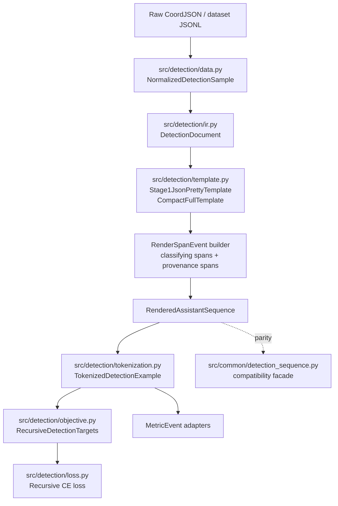
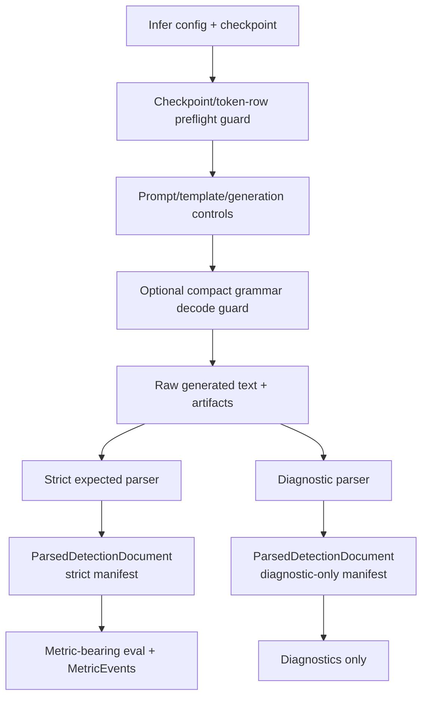

# Grounding Sequence IR and Detection Template Normalization Design

Date: 2026-05-04

Worktree: `/data/CoordExp/.worktrees/compact-detection-sequence`

Branch: `codex/compact-detection-sequence`

Grounded snapshot: latest inspected branch state after:

| Commit | Meaning |
|---|---|
| `d94da8c` | `feat(infer): add compact-full decode guards` |
| `e78a174` | `feat(train): require compact token-row configs` |
| `393b66f` | `fix(optim): dedupe fallback offset params` |

Status: design/spec only. This document does not authorize code implementation by itself.

## Purpose

Normalize the current compact-detection-sequence branch around a shared detection sequence hierarchy so the training, loss, metric, inference, parser, and artifact surfaces can support both first-class template families without duplicating semantics:

| Template family | First-class template id | Current role |
|---|---|---|
| Standard JSON chat template | `stage1_json_pretty` | Canonical CoordJSON-style assistant payload with `objects`, nested entries, `desc`, `bbox_2d`, punctuation, keys, brackets, quotes, commas, newlines, and spaces. |
| Compact detection sequence template | `compact_full` | Production compact row format using `<|object_ref_start|>`, description text, `<|box_start|>`, and four `<|coord_*|>` tokens. |

The target architecture is template-agnostic above the adapter layer:

```text
Raw dataset row / CoordJSON
  -> source-normalized sample
  -> semantic DetectionDocument IR
  -> template adapter
  -> rendered assistant sequence with spans
  -> encoded sequence view with token roles and causal positions
  -> objective sidecars, loss, metrics, parsers, artifacts
```

The major design rule is:

```text
Exact rendered bytes are owned by template adapters.
Semantic object and geometry meaning is owned by the IR.
Token labels, masks, roles, and positions are owned by the encoded view.
Loss and metrics consume those contracts instead of re-parsing template text.
Strict parser manifests, not IR objects alone, determine metric eligibility.
```

## Current branch facts

The current branch already has a substantial latest compact detection stack. This refactor should consolidate it, not replace it with a parallel stack.

| Surface | Current owner | Current facts to preserve |
|---|---|---|
| Latest config contract | `src/config/schema.py` | Latest detection configs require `data`, `prompt`, `detection_template`, `token_rows`, `objective`, `packing`, `evaluation`, and `validation`; compact-full requires coord-token rows plus compact structural rows. |
| Data normalization | `src/detection/data.py` | Owns raw row parsing, `NormalizedDetectionSample`, object ordering, object ids, source indices, desc, and coord-token boxes. |
| Template adapters | `src/detection/template.py` | Owns `DetectionSequenceTemplate`, `Stage1JsonPrettyTemplate`, `CompactFullTemplate`, `CharSpan`, `RenderedObjectEntry`, and `RenderedAssistantSequence`. |
| Encoded view | `src/detection/tokenization.py` | Owns chat-template tokenization, char-to-token alignment, `TokenRole`, `TokenizedObjectEntry`, `TokenizedDetectionExample`, role masks, and labels. |
| Recursive objective sidecars | `src/detection/objective.py` | Owns `PreparedDetectionExample`, `RecursiveDetectionTargets`, `TokenTarget`, `SemanticRole`, `LossAtom`, ET-RMP-CE target construction, and semantic normalization. |
| Loss | `src/detection/loss.py` | Consumes logits plus aligned recursive sidecars; uses `logits[position - 1]` for `TokenTarget.position`. |
| Dataset integration | `src/detection/dataset.py` | Bridges rendered/prepared examples to actual Swift-encoded `input_ids` and `labels`; shifts sidecar positions onto encoded positions. |
| Parser/eval manifest | `src/detection/evaluation.py` | Separates `strict_expected` metric-bearing parsing from diagnostic parser modes. |
| Packing/cache policy | `src/detection/packing.py`, `src/sft.py` | Latest compact recursive detection remains packing/cache disabled until sidecar rewriting and fingerprints exist. |
| SFT wiring | `src/sft.py` | Builds latest datasets, applies runtime failfast checks, preserves sidecars through trainer plumbing, and attaches recursive CE runtime weights. |
| Compact common helpers | `src/common/detection_sequence.py` | Public render/parse compatibility facade for `coordjson`, `compact_full`, `compact_no_desc`, `compact_no_bbox`, and `compact_min`. |
| Compact decode guards | `src/infer/compact_grammar.py`, `src/infer/backends.py`, `src/infer/pipeline.py` | Optional HF-only compact-full logits processor; structural decode guard, not parser/eval success. |
| Compact checkpoint guard | `src/infer/checkpoints.py` | Adapter inference for compact-full requires tied compact token-row offsets for object start, box start, and all 1000 coord tokens. |

The production compact latest surface is currently:

```text
configs/stage1/recursive_detection_ce_latest/prod/compact_full_support2.yaml
```

Core production invariants:

| Config area | Current invariant |
|---|---|
| `detection_template.id` | `compact_full` |
| `detection_template.coordinate_surface` | `coord_token` |
| `detection_template.bbox_format` | `xyxy` |
| `objective.variant` | `random_permutation_et_rmp_ce` |
| `objective.normalization` | `semantic_image_bucket_balanced` |
| `token_rows.enabled` | `true` |
| `token_rows.groups.coord_geometry` | `<|coord_0|>` through `<|coord_999|>` |
| `token_rows.groups.compact_structure.tokens` | `<|object_ref_start|>`, `<|box_start|>` |
| `training.packing` | `false` |
| `training.encoded_sample_cache.enabled` | `false` |
| `packing.static_packing` | `false` |
| `packing.padding_free_packed` | `false` |
| `evaluation.expected_template` | `compact_full` |
| `evaluation.parser_mode` | `strict_expected` |

## Design consensus from subagent audit

Multiple read-only subagents reviewed the branch-local worktree from different perspectives. Their strongest overlapping conclusions were:

| Consensus | Design decision |
|---|---|
| Keep the hierarchy under `src/detection/*`. | Do not create a parallel `src/grounding/*` stack for this refactor. |
| Add one semantic IR spine. | Introduce `src/detection/ir.py` as the semantic detection document owner, initially adapter-only over current normalized samples. |
| Keep exact bytes in template adapters. | `Stage1JsonPrettyTemplate` and `CompactFullTemplate` remain first-class leaf templates. |
| Do not let `src/common/detection_sequence.py` become canonical IR. | Treat it as a compatibility facade and parity-test it against training templates before delegation. |
| Make render spans explicit before metrics. | Add a span/event taxonomy with classifying spans, provenance containers, primary roles, mask groups, priorities, and conflict rules. |
| Make encoded positions explicit. | Record label positions and next-token prediction positions; preserve `TokenTarget.position -> logits[position - 1]`. |
| Preserve dataset alignment as the production bridge. | `DetectionTrainingDataset` remains the only owner that can shift prepared sidecars into actual Swift-encoded positions. |
| Metric aliases must not drift. | `coord_token_acc` and `coord_token_acc_top5` remain full-vocabulary coordinate-position metrics. |
| Strict parser surfaces are metric-bearing; diagnostics are not. | Shared IR may be returned by strict or diagnostic parsers, but metric eligibility requires a strict parser manifest. |
| Packing/cache remains disabled for latest compact recursive detection. | Future enablement requires segment maps, sidecar rewrites, sidecar-aware fingerprints, and failfast tests. |

## Target module hierarchy

The target hierarchy stays centered on `src/detection/`:

```text
src/detection/
  data.py
    Raw JSONL and CoordJSON parsing.
    Dataset/source normalization into NormalizedDetectionSample.
    Object ordering realization.

  ir.py
    Template-independent semantic detection IR.
    DetectionDocument.
    DetectionObjectEntry.
    DetectionGeometry / BoxGeometry.
    DetectionCoordinateSlot.
    ParsedDetectionDocument wrapper with parser manifest.
    Adapter from NormalizedDetectionSample.

  template.py
    Template adapter protocol and registry.
    Stage1JsonPrettyTemplate.
    CompactFullTemplate.
    RenderedAssistantSequence.
    RenderedObjectEntry.
    CharSpan.
    Internal render span event builder.

  tokenization.py
    Rendered assistant sequence -> chat-tokenized encoded view.
    TokenRole.
    TokenSpan.
    TokenizedObjectEntry.
    TokenizedDetectionExample.
    Role/mask projection and causal position contract.

  objective.py
    PreparedDetectionExample.
    RecursiveDetectionTargets.
    TokenTarget.
    SemanticRole.
    LossAtom.
    ET-RMP-CE target construction.

  loss.py
    Recursive CE loss math only.
    No template parsing, rendering, dataset, packing, or cache policy.

  evaluation.py
    Strict expected-template parser entrypoints.
    Parser/eval manifest metadata.
    Diagnostic-vs-canonical parser surface separation.

  packing.py
    Packing eligibility.
    Sidecar/cache fingerprint policy.
```

Keep `src/common/detection_sequence.py` as:

```text
src/common/detection_sequence.py
  Lightweight public render/parse facade.
  Shared format names and required special-token helpers.
  Compatibility surface for inference or non-training code.
  Not the semantic IR owner.
  Not the rendered span owner.
  Not the token-role owner.
  Not the objective sidecar owner.
  Not the metric event owner.
```

## Layered architecture

| Layer | Owner | Consumes | Produces | Must not do |
|---|---|---|---|---|
| Config contract | `src/config/schema.py` | YAML/latest config | Typed latest training config and failfast validation | Build sidecars or infer target positions. |
| Source normalization | `src/detection/data.py` | Raw JSONL / CoordJSON rows | `NormalizedDetectionSample` | Own template bytes or metric meanings. |
| Semantic IR | `src/detection/ir.py` | `NormalizedDetectionSample` or parsed objects | `DetectionDocument` | Become a second renderer or imply metric eligibility. |
| Template adapter | `src/detection/template.py` | `DetectionDocument` or adapter-compatible normalized sample | Exact `RenderedAssistantSequence` and spans | Define loss normalization, parser metric surfaces, or token-row policy. |
| Render span projection | `src/detection/template.py` internals | Template emission events | `RenderedObjectEntry` and sequence span projections | Rely on broad assistant/object spans as classifying schema spans. |
| Encoded view | `src/detection/tokenization.py` | Rendered assistant sequence plus chat template/tokenizer | `TokenizedDetectionExample`, labels, roles, masks, label/prediction positions | Parse compact rows or JSON independently. |
| Objective sidecars | `src/detection/objective.py` | Encoded detection view | `RecursiveDetectionTargets`, `TokenTarget`, `LossAtom` | Re-encode Swift messages or apply packing offsets. |
| Dataset alignment | `src/detection/dataset.py` | Prepared view plus actual Swift-encoded sample | Encoded sample with aligned sidecars | Let sidecars skip encoded validation. |
| Runtime wiring | `src/sft.py` | Latest config and datasets | Trainer, collator, recursive CE cfg | Build targets or silently enable packing/cache. |
| Loss | `src/detection/loss.py` | Logits plus aligned recursive sidecars | Loss tensor and loss metrics | Reconstruct semantic objects or template state. |
| Strict parsing | `src/detection/evaluation.py` | Raw generated assistant text | Parsed document and strict parser manifest | Salvage, auto-detect, or silently relax metric parsing. |
| Diagnostic parsing | future `src/detection/evaluation.py` or `src/detection/diagnostics.py` | Raw generated assistant text | Diagnostic parsed document and diagnostic-only manifest | Feed official metric reducers. |
| Metric events | future `src/metrics/events.py`, `src/metrics/detection_sequence.py` | Encoded/loss/parser outputs | Denominator-safe metric events and flat logs | Change legacy alias semantics. |
| Inference guards | `src/infer/*` | Infer config/checkpoint/tokenizer | Decode/checkpoint/artifact guard metadata | Treat grammar/checkpoint success as parser success. |

## Semantic IR contracts

### `DetectionDocument`

`DetectionDocument` is the template-independent semantic detection document. It should initially be an adapter over current `NormalizedDetectionSample`, not a behavior-changing replacement.

Conceptual shape:

```python
@dataclass(frozen=True)
class DetectionDocument:
    objects: tuple[DetectionObjectEntry, ...]
    object_ordering: ObjectOrderingPlan
    coordinate_surface: str
    bbox_format: str
    metadata: Mapping[str, object]
```

Rules:

| Rule | Requirement |
|---|---|
| Source-normalized sample remains valid | `NormalizedDetectionSample` remains the data/source normalization surface. |
| IR is initially adapter-only | `DetectionDocument.from_normalized_sample(...)` must preserve current behavior. |
| No byte ownership | IR cannot decide JSON punctuation, compact sentinels, row separators, or terminal bytes. |
| No metric eligibility | IR objects require parser manifests before entering eval. |
| Metadata is non-model | Metadata may support manifests, cache keys, and diagnostics, but is not model input. |

### `DetectionObjectEntry`

Conceptual shape:

```python
@dataclass(frozen=True)
class DetectionObjectEntry:
    object_instance_id: str
    object_index: int
    source_object_index: int
    desc: str
    geometry: DetectionGeometry
    field_order_policy: str
```

Required identity fields across IR, spans, targets, metrics, and artifacts:

| Field | Meaning |
|---|---|
| `object_instance_id` | Stable realized object instance id for ordering/target binding. |
| `object_index` | Realized object index in the current sequence/order. |
| `source_object_index` | Original source object index before ordering/permutation. |
| `realized_source_object_indices` | Sequence-level order provenance. |
| `template_id` | Rendering/parser template id. |
| `template_version` | Template contract version. |
| `coordinate_surface` | Current surface, for example `coord_token`. |
| `bbox_format` | Current geometry format, for example `xyxy`. |

### `DetectionGeometry` and `DetectionCoordinateSlot`

Current implementation scope is bbox-only, but the IR should leave room for later points, polygons, masks, rotated boxes, and multi-box references.

Conceptual bbox shape:

```python
@dataclass(frozen=True)
class BoxGeometry:
    bbox_format: str
    coordinate_surface: str
    slots: tuple[DetectionCoordinateSlot, ...]
```

Conceptual coordinate slot shape:

```python
@dataclass(frozen=True)
class DetectionCoordinateSlot:
    object_instance_id: str
    object_index: int
    slot_name: Literal["x1", "y1", "x2", "y2"]
    norm1000_value: int | None
    coord_token: str
    coord_token_id: int | None
    render_text: str
```

Slot naming rule:

```text
Use semantic slot names `x1`, `y1`, `x2`, `y2` for IR and metrics.
Keep legacy char-span labels like `coord_0` only as compatibility/debug labels if needed.
```

## Parsed detection document contract

Strict and diagnostic parsers may both return semantic IR-shaped objects, but the parser manifest determines whether a parsed object can enter official metric eval.

Conceptual shape:

```python
@dataclass(frozen=True)
class ParsedDetectionDocument:
    document: DetectionDocument
    parser_manifest: DetectionTemplateEvalManifest
    source_text: str
    parse_errors: tuple[str, ...] = ()
```

Rules:

| Rule | Requirement |
|---|---|
| IR does not imply metric eligibility | Consumers must check `parser_manifest.diagnostic_only` and `parser_manifest.metric_surface`. |
| Strict parsed documents may enter metric eval | Only when `parser_mode == "strict_expected"` and `diagnostic_only is False`. |
| Diagnostic parsed documents are analysis-only | They may reuse `DetectionDocument`, but cannot feed official metric reducers. |
| Missing manifest fails closed | Metric adapters should reject parsed documents without metric-surface metadata. |

Required invariant for official metric adapters:

```python
assert parsed.parser_manifest.parser_mode == "strict_expected"
assert parsed.parser_manifest.metric_surface == "strict_expected_template"
assert parsed.parser_manifest.diagnostic_only is False
```

## Template adapter contracts

### Shared template protocol

Template adapters should expose one behavior-preserving public path:

```text
DetectionDocument or adapter-compatible normalized sample
  -> DetectionSequenceTemplate.render_assistant(...)
  -> RenderedAssistantSequence
```

Adapters must not independently define object identity, coordinate slot semantics, token-role priority, metric aliases, or loss normalization.

### `Stage1JsonPrettyTemplate`

Responsibilities:

| Responsibility | Contract |
|---|---|
| Exact bytes | Preserve canonical CoordJSON text from `dumps_coordjson`. |
| Strict parse | Parse only the expected standard JSON template surface. |
| JSON schema spans | Emit object/key/punctuation/field-binding/terminal spans without shadowing desc or coord spans. |
| Desc spans | Inner description text is `DESC`; quotes and punctuation are schema/control if explicitly represented. |
| Coord spans | Coordinate token spans are semantic `COORD` slots. |

Known caveat to test before claiming full schema coverage:

```text
JSON desc outer quotes/control characters may currently fall back to object/container spans if not represented as explicit control spans. A future implementation must either add those spans or document the fallback as a known gap.
```

### `CompactFullTemplate`

Responsibilities:

| Responsibility | Contract |
|---|---|
| Exact bytes | Preserve rows of `<|object_ref_start|>{desc}<|box_start|><|coord_x1|><|coord_y1|><|coord_x2|><|coord_y2|>`. |
| Row separator | Preserve newline-separated rows. |
| Terminal close | Preserve current zero-length compact assistant-local terminal close unless a future template explicitly adds one. |
| Strict parse | Parse only expected `compact_full`. |
| Span emission | Emit object-ref marker, desc text, bbox-start marker, four coordinate slots, row separators, object containers, and trie-eligible spans. |

The compact grammar logits processor is not part of this template adapter. It is decode-time-only inference behavior.

### Future compact variants

Existing common helper names include:

```text
compact_no_desc
compact_no_bbox
compact_min
```

Caveat:

```text
Current `compact_no_desc` appears to mean no object-ref marker, not no semantic description.
Current `compact_no_bbox` appears to mean no box-start marker, not no semantic bbox coordinates.
```

Do not promote these names as semantic template ids without clarifying marker-vs-content meaning. Prefer future ids such as:

```text
compact_no_object_ref_marker
compact_no_box_start_marker
compact_minimal_markers
```

Future variants should be spec-driven rather than copy-pasted classes:

```python
@dataclass(frozen=True)
class CompactRowSpec:
    template_id: str
    detection_sequence_format: str
    include_object_ref_start: bool
    include_desc: bool
    include_box_start: bool
    include_coords: bool
    row_separator: str
    terminal_close: str
    strict_parse: bool
```

Promotion gate for any new compact template id:

| Gate | Requirement |
|---|---|
| Render bytes | Exact fixture tests. |
| Strict parser | Template-specific parse tests. |
| Render spans | Span event coverage tests. |
| Token roles | Tokenization role/mask projection tests. |
| Config | Latest config validation if trainable. |
| Eval | Parser manifest and metric-surface policy. |
| Inference | Decode guard support only if explicitly implemented. |

## Common detection sequence facade

`src/common/detection_sequence.py` is a compatibility facade, not the canonical owner of semantic IR or training sidecars.

Allowed responsibilities:

| Allowed | Notes |
|---|---|
| Public format constants | `coordjson`, `compact_full`, marker-omission helper formats. |
| Required special-token helpers | Useful for tokenizer/config/checkpoint surfaces. |
| Lightweight render/parse wrappers | Useful outside training and for compatibility. |
| Compatibility parser behavior | May return `None`, strip generation suffixes, or support auto-detect/salvage if documented as diagnostic/compatibility behavior. |

Not allowed as canonical responsibilities:

| Not allowed | Canonical owner |
|---|---|
| `DetectionDocument` | `src/detection/ir.py` |
| `RenderedAssistantSequence` and spans | `src/detection/template.py` |
| `TokenRole` and masks | `src/detection/tokenization.py` |
| `RecursiveDetectionTargets` | `src/detection/objective.py` |
| `MetricEvent` semantics | future metrics modules |
| Packing/cache sidecar fingerprints | `src/detection/packing.py` plus runtime wiring |

Near-term rule:

```text
Parity-test `compact_full` behavior between `src/common/detection_sequence.py` and `CompactFullTemplate` before refactoring or delegation.
Prefer fixture parity first; delegate later only after import boundaries are proven safe.
```

## Render span projection contract

### Why this contract exists

The current implementation has useful span containers, but a string label plus call-order priority is too fragile for future templates, token categories, and metrics. The design needs an explicit taxonomy.

### Primitive span

`CharSpan` remains simple:

```python
@dataclass(frozen=True)
class CharSpan:
    start: int
    end: int
    label: str
```

Rules:

| Rule | Requirement |
|---|---|
| Assistant-local | Character offsets are half-open and assistant-local unless explicitly documented otherwise. |
| Debug label | `label` is stable/debug metadata, not the whole semantic taxonomy. |
| Zero-length allowed | Zero-length spans are valid render provenance but do not align to tokens. |

### Rich render span event

Add an internal richer event or equivalent normalized representation:

```python
@dataclass(frozen=True)
class RenderSpanEvent:
    char_span: CharSpan
    span_kind: SpanKind
    primary_role: TokenRole | None
    mask_groups: frozenset[MaskGroup]
    classifying: bool
    priority: int
    object_instance_id: str | None = None
    object_index: int | None = None
    source_object_index: int | None = None
    geometry_kind: str | None = None
    slot_name: str | None = None
    provenance: SpanProvenance | None = None
```

Projection rule:

```text
Templates emit render span events.
Existing `RenderedObjectEntry` and `RenderedAssistantSequence` fields are projections from those events.
Tokenization aligns events to token spans and derives primary roles plus masks using deterministic priority and conflict rules.
```

### Span kinds

| Span kind | Examples | Classifying? | Primary token role |
|---|---|---:|---|
| `assistant_container` | Full assistant text | No | `ASSISTANT` fallback only |
| `object_entry_container` | One JSON object or compact row | No | `OBJECT_ENTRY` fallback only |
| `bbox_container` | Coordinate list or compact bbox tail | No | None |
| `trie_eligible_container` | Object surface used by recursive trie | No | None |
| `description_text` | `cat`, `traffic light` | Yes | `DESC` |
| `coordinate_slot` | `<|coord_10|>` for `x1` | Yes | `COORD` |
| `object_ref_marker` | `<|object_ref_start|>` | Yes | `CONTROL` |
| `bbox_start_marker` | `<|box_start|>` | Yes | `BBOX_START` |
| `bbox_field_binding` | `"bbox_2d": [` | Yes | `BBOX_START` |
| `json_key` | `"objects"`, `"desc"` | Yes | `CONTROL` |
| `json_punctuation` | `{`, `}`, `[`, `]`, quotes | Yes | `CONTROL` |
| `field_separator` | `, ` between fields | Yes | `SEPARATOR` or `CONTROL` by explicit event |
| `object_separator` | JSON object comma or compact newline | Yes | `SEPARATOR` |
| `coordinate_separator` | Comma between JSON coords | Yes | `SEPARATOR` |
| `terminal_close` | JSON `]}` | Yes | `TERMINAL` |
| `chat_stop_marker` | `<|im_end|>` after assistant text | Yes | `TERMINAL` |
| `tokenizer_eos` | Tokenizer EOS if distinct | Yes | `TERMINAL` |
| `unknown_assistant_text` | Assistant-local text not covered by narrower spans | No or diagnostic | `ASSISTANT` / `OBJECT_ENTRY` fallback |

### Mask groups

A token may have one primary role and multiple mask memberships.

Recommended groups:

```text
assistant
object_entry
description
bbox
bbox_start
coordinate
separator
terminal
control
schema
trie_eligible
ignored
```

Examples:

| Token surface | Primary role | Mask groups |
|---|---|---|
| `<|box_start|>` | `BBOX_START` | `bbox_start`, `control`, `schema` |
| JSON coordinate comma | `SEPARATOR` | `separator`, `control`, `schema`, `bbox` |
| `<|coord_42|>` | `COORD` | `coordinate`, `bbox` |
| JSON terminal `]}` | `TERMINAL` | `terminal`, `control`, `schema` |
| Chat `<|im_end|>` | `TERMINAL` | `terminal`, plus `schema` only if explicitly configured |

### Priority order

Do not rely on call order for role assignment. Use explicit priority.

| Priority | Role | Meaning |
|---:|---|---|
| 100 | `COORD` | Coordinate slot tokens. |
| 90 | `DESC` | Description/class/free-text tokens. |
| 80 | `TERMINAL` | Assistant-local terminal close, chat stop, EOS. |
| 70 | `BBOX_START` | Bbox marker or bbox field binding. |
| 60 | `SEPARATOR` | Object, field, and coordinate separators. |
| 50 | `CONTROL` | Other schema/control tokens. |
| 20 | `OBJECT_ENTRY` | Object container fallback. |
| 10 | `ASSISTANT` | Assistant container fallback. |
| 0 | `IGNORE` | Prompt/uncovered/unsupported. |

### Allowed overlaps

| Allowed overlap | Meaning |
|---|---|
| `assistant_container` contains all assistant-local leaves | Provenance/container only. |
| `object_entry_container` contains desc, coords, markers, separators | Provenance/container only. |
| `bbox_container` contains bbox markers, separators, coords | Provenance/container only. |
| `trie_eligible_container` overlaps object entry | Decode/objective provenance only. |
| Mask groups overlap primary roles | A single event can be both primary `BBOX_START` and schema/control by mask group. |

### Disallowed overlaps

| Disallowed overlap | Required behavior |
|---|---|
| `DESC` overlaps `COORD` | Fail or emit explicit high-severity diagnostic. |
| `DESC` overlaps `BBOX_START` | Fail or emit explicit high-severity diagnostic. |
| `COORD` overlaps `BBOX_START` | Fail or emit explicit high-severity diagnostic. |
| Two coordinate slots overlap | Fail. |
| Equal-priority classifying spans overlap | Fail or deterministic diagnostic; never silently pick by call order. |
| Broad classifying schema span covers whole assistant | Disallow; use container/provenance span instead. |

### Separator ownership

Object separator spans are sequence-level spans. They may be attached to the preceding `RenderedObjectEntry` as a convenience projection, but they are not part of the next object and must not affect object identity or coordinate-slot metrics.

### Terminal categories

Represent terminal semantics separately:

| Category | Example | Notes |
|---|---|---|
| `json_terminal_close` | `]}` | Assistant-local terminal close. |
| `compact_terminal_close` | zero-length for compact-full v1 | Render provenance only; skipped during token alignment. |
| `chat_stop_marker` | `<|im_end|>` | Produced by chat template, may be supervised if current contract requires it. |
| `tokenizer_eos` | EOS token | Distinct only if tokenizer exposes it separately. |

Rules:

```text
Zero-length terminal spans are valid render provenance but skipped by token alignment.
Chat stop markers may be supervised through terminal masks only if documented as the intended contract.
Terminal role overrides assistant/container fallback.
Terminal tokens do not count as coordinate or description metrics.
```

## Token role and encoded view contracts

### `TokenRole`

Keep the current enum stable in the first implementation pass:

```text
IGNORE
ASSISTANT
OBJECT_ENTRY
DESC
BBOX_START
COORD
SEPARATOR
TERMINAL
CONTROL
```

Interpretation:

| Role | Meaning |
|---|---|
| `IGNORE` | Outside supervised/rendered assistant scope or failed alignment. |
| `ASSISTANT` | Broad assistant container fallback, not a metric role when narrower role exists. |
| `OBJECT_ENTRY` | Broad object container fallback, not a metric role when narrower role exists. |
| `DESC` | Semantic description/class/free-text tokens. |
| `BBOX_START` | Bbox field or marker binding; schema/control but separately useful. |
| `COORD` | Coordinate slot tokens. |
| `SEPARATOR` | Object/field/coordinate separators. |
| `TERMINAL` | Assistant terminal close, chat stop marker, or EOS-style terminal. |
| `CONTROL` | Generic schema/control token. |

Do not collapse `BBOX_START` into `CONTROL` yet. It should remain its own primary role while also belonging to schema/control mask groups.

### `TokenizedDetectionExample`

`TokenizedDetectionExample` is the encoded sequence view. It should own:

| Field family | Contract |
|---|---|
| Token data | `input_ids`, `labels`, `offset_mapping`. |
| Render provenance | `rendered_assistant`, assistant token spans, object token spans, terminal/stop spans. |
| Roles and masks | `token_roles`, desc/coord/bbox/separator/terminal/control masks. |
| Position metadata | Supervised label positions and next-token prediction positions. |
| Alignment diagnostics | Position origin, skipped spans, role conflicts, fallback counts if implemented. |

Add or derive:

```text
supervised_label_positions: tuple[int, ...]
next_token_prediction_positions: tuple[tuple[int, int], ...]
token_position_origin: str
alignment_diagnostics: AlignmentDiagnostics
```

Causal position contract:

```text
`TokenTarget.position` is a label/input-id position.
The predictive logit position is `position - 1`.
`position == 0` is invalid for recursive CE targets.
```

The encoded view should make this explicit instead of forcing objective/loss code or future metrics to rediscover the convention.

## Objective and loss contracts

### `TokenTarget`

`TokenTarget.position` refers to the supervised label/input-id position in the encoded sample after dataset alignment.

Rules:

| Rule | Requirement |
|---|---|
| Position origin | `RecursiveDetectionTargets.token_position_origin` must identify whether targets are prepared or actual encoded positions. |
| Training-ready sidecars | Trainer/loss should see `DetectionTrainingDataset.encoded` positions. |
| Loss indexing | Loss uses `logits[position - 1]` to predict `labels[position]`. |
| Loss atom coverage | Every `TokenTarget` maps to exactly one `LossAtom`. |
| No duplicate semantic assignment | Missing or duplicate loss-atom assignment is a correctness bug. |

### Loss naming bridge

Public latest config/runtime uses `trie_support_weight` and `trie_balance_weight`.

If internal loss dataclasses retain `branch_support_weight` and `branch_balance_weight`, that is an internal compatibility adapter only. Old `branch_*` config keys must not re-enter the latest schema.

Recommended boundary:

| Name family | Scope |
|---|---|
| `trie_support_weight`, `trie_balance_weight` | Public latest config/runtime. |
| `branch_support_weight`, `branch_balance_weight` | Internal legacy loss adapter only, or future rename target. |

## Dataset, sidecar, runtime, and packing contracts

### Dataset alignment

`DetectionTrainingDataset` remains the production bridge that sees both the prepared detection view and the actual Swift-encoded model-ready sample.

Rules:

| Rule | Requirement |
|---|---|
| Constant-shift validation | Prepared supervised token ids must match actual encoded labels under a constant position shift. |
| Sidecar rewrite | `TokenTarget.position` and `LossAtom.token_positions` must both be shifted. |
| Encoded origin | Aligned sidecars must record encoded position origin. |
| No bypass | Sidecars cannot be consumed by trainer/loss until they match actual encoded `input_ids` and `labels`. |

### Sidecar registry and model-input stripping

Every non-model batch extra should be registered and either consumed by the trainer/mixin or stripped before model forward.

Candidate sidecar keys:

```text
recursive_detection_targets
detection_metadata
assistant_payload
sample_id
dataset
base_idx
```

Rules:

| Rule | Requirement |
|---|---|
| Sidecars survive collation when needed | Recursive CE must preserve sidecars through Trainer column filtering. |
| Model forward stays clean | Sidecars must not be passed into model forward unless explicitly supported. |
| Registry is explicit | Future sidecars require adding to the allowed sidecar registry. |
| Unknown extras fail or warn loudly | Silent pass-through risks model-forward crashes or hidden data leakage. |

### Packing and cache policy

Latest compact recursive detection remains packing/cache disabled.

Current disabled surfaces:

```text
training.packing
training.encoded_sample_cache.enabled
packing.static_packing
packing.padding_free_packed
```

Future enablement requires a separate design and all of the following:

| Requirement | Why |
|---|---|
| Segment map | Map original sample id and original label position to packed label position. |
| Rewritten `TokenTarget.position` | Prevent off-by-one/cross-sample loss. |
| Rewritten `LossAtom.token_positions` | Preserve semantic normalization and diagnostics. |
| Attention/mask semantics | Prevent invalid cross-sample supervision. |
| Sidecar schema version | Keep cache compatibility explicit. |
| Cache fingerprint fields | Include tokenizer/template identity, prompt identity, object ordering policy, token rows, state weighting, normalization, and position-origin policy. |
| Negative failfast test | Enabling packing/cache without sidecar rewriting must fail before training. |
| Positive mapping test | Every sidecar position maps to exactly one packed label position with no target collision. |

## Inference, parser, and eval hierarchy

Inference/eval has its own guard hierarchy. It must stay separate from shared IR.

| Layer | Owner | May affect decoding? | May produce metric-bearing objects? | Required metadata |
|---|---|---:|---:|---|
| Checkpoint/token-row guard | `src/infer/checkpoints.py` | no | no | checkpoint mode, resolved base/adapter, compact row guard result. |
| Compact grammar decode guard | `src/infer/compact_grammar.py`, `src/infer/backends.py`, `src/infer/pipeline.py` | yes | no | enabled, active, format, force_row_start. |
| Raw inference artifacts | `src/infer/artifacts.py`, `src/infer/pipeline.py` | no | no | template/format/checkpoint/generation/artifact paths. |
| Strict expected parser | `src/detection/evaluation.py` | no | yes | expected_template, parser_mode, coordinate_surface, metric_surface. |
| Diagnostic parser | future `src/detection/evaluation.py` or diagnostics module | no | no | parser_mode, diagnostic_only, failure/salvage counters. |
| Shared IR | `src/detection/ir.py` | no | only when paired with strict manifest | parser manifest plus semantic object/geometry/span provenance. |

### Checkpoint/token-row guard scope

The compact checkpoint guard is model-compatibility preflight. It prevents adapter inference when compact trainable token-row offsets would be inactive.

It is not:

```text
a parser
a metric surface
a substitute for strict expected-template validation
evidence that generated text is parse-valid
```

### Compact grammar scope

Compact grammar metadata is decode provenance, not parser provenance.

Rules:

| Rule | Requirement |
|---|---|
| Opt-in only | Compact grammar remains disabled unless config enables it. |
| HF-only currently | Non-HF grammar requests fail fast. |
| `compact_full` only currently | Non-compact grammar requests fail fast. |
| Not parse certification | Grammar-enabled outputs still need strict expected-template parsing. |
| Parse failures remain failures | Grammar-enabled outputs that fail strict parsing remain strict-surface parse failures. |

### Strict parser surface

Metric-bearing detection eval must call the strict expected-template parser for the configured expected template.

Required strict manifest fields:

```text
expected_template
parser_mode = strict_expected
metric_surface = strict_expected_template
diagnostic_only = false
coordinate_surface
benchmark_scope
detection_sequence_format
bbox_format
artifact_root
```

### Diagnostic parser surface

Diagnostic parser outputs may be useful for parse categorization, model diagnosis, and future data triage. They must not feed official metrics unless a future spec defines a separate metric surface and comparison policy.

Required diagnostic manifest fields:

```text
parser_mode = diagnostic_auto_detect or diagnostic_salvage
metric_surface = diagnostic_only
diagnostic_only = true
failure/salvage counters if available
```

Invariant:

```text
Diagnostic parser output -> official metric reducer must not exist.
```

### Artifact metadata

Metric-bearing eval artifacts must record parser metadata in `resolved_config.json`, eval summary, or a dedicated eval manifest.

Required comparison keys:

```text
expected_template
detection_sequence_format
parser_mode
metric_surface
diagnostic_only
coordinate_surface
bbox_format
prompt_variant
prompt_template_hash
object_ordering
object_field_order
checkpoint_mode
resolved_base_model_checkpoint
resolved_adapter_checkpoint
generation.compact_grammar.enabled
generation.compact_grammar.active
generation.compact_grammar.format
benchmark_scope
limit
metrics_mode
artifact_root
```

Raw/scored artifact family is orthogonal to parser mode:

| Artifact family | Meaning | Parser implication |
|---|---|---|
| `gt_vs_pred.jsonl` | Raw predictions | None by itself. |
| `gt_vs_pred_scored.jsonl` | Predictions with scores | None by itself. |
| Strict parsed output | Expected-template-valid parsed predictions | Metric-bearing if manifest says strict. |
| Diagnostic parsed output | Salvaged/autodetected predictions | Diagnostic-only even if scored. |

## Metric event contract

Metrics should be represented as typed events before being flattened into trainer logs or artifact JSON.

### `MetricEvent`

Conceptual shape:

```python
@dataclass(frozen=True)
class MetricEvent:
    key: str
    numerator: float | None
    denominator: float | None
    value: float | None
    reducer: Literal["ratio", "weighted_mean", "sum", "last"]
    unit: Literal["token", "span", "object", "slot", "image", "batch", "sample"]
    semantic_role: str | None
    token_role: str | None
    vocab_scope: str | None
    coordinate_surface: str | None
    geometry_type: str | None
    slot_name: str | None
    object_scope: str | None
    template_id: str | None
    parser_mode: str | None
    metric_surface: str | None
    diagnostic_only: bool
    aliases: tuple[str, ...] = ()
```

### Identity axes

Metric identity must include enough axes to prevent silent alias drift.

| Axis | Examples |
|---|---|
| Semantic role | `description_identity`, `bbox_coord`, `schema_control`, `terminal_stop`. |
| Token role | `DESC`, `COORD`, `CONTROL`, `BBOX_START`. |
| Vocab scope | `full_vocab`, `coord_vocab`, `coord_vocab_mass`, `structural_vocab`. |
| Unit | `token`, `span`, `object`, `slot`, `image`, `batch`. |
| Reducer | `ratio`, `weighted_mean`, `sum`, `last`. |
| Denominator semantics | tokens, slots, objects, valid parses, images. |
| Template/parser surface | `compact_full`, `stage1_json_pretty`, `strict_expected_template`, `diagnostic_only`. |
| Coordinate slot | `x1`, `y1`, `x2`, `y2`. |

### Reducer rules

| Reducer | Rule |
|---|---|
| `ratio` | Sum numerator and denominator first, then divide. |
| `weighted_mean` | Sum weighted values and weights first, then divide. |
| `sum` | Add values/counters. |
| `last` | Only for gauges/config-like fields, not accuracy/loss rates. |

### Legacy alias policy

Freeze existing meanings:

| Alias | Meaning |
|---|---|
| `coord_token_acc` | Full-vocabulary coordinate-position top-1 accuracy. |
| `coord_token_acc_top5` | Full-vocabulary coordinate-position top-5 accuracy. |

Rules:

| Rule | Requirement |
|---|---|
| No alias overload | Do not reuse `coord_token_acc` for coord-vocab-restricted accuracy. |
| Coord-vocab metrics need new keys | For example `coord_vocab_token_acc` or another explicit canonical key. |
| Duplicate aliases fail | Alias collisions must be caught before logging. |
| Diagnostic metrics stay separate | Diagnostic parser metrics cannot share strict metric aliases. |

## Object-entry and coordinate-slot metrics

Desired reporting families:

| Family | Unit | Examples |
|---|---|---|
| Schema/control | token/span | Schema-token CE, schema-token accuracy, bbox-start accuracy, terminal accuracy. |
| Description | token/span/object | Desc-token CE, desc-token top-k, description exact span match. |
| Coordinate | token/slot/object | Coordinate-token CE, coordinate-token top-k, x1/y1/x2/y2 slot accuracy. |
| Object entry | object/span | Object-entry exact sequence match, entry trie decision accuracy, desc-plus-box binding success. |
| Parser/eval | sample/image | Strict parse success, diagnostic salvage rate, strict metric-bearing object counts. |

Denominator policy must be explicit:

| Metric | Denominator |
|---|---|
| Token accuracy | Number of supervised tokens in that role/scope. |
| Slot accuracy | Number of coordinate slots. |
| Object-entry exact match | Number of object entries. |
| Parse success | Number of generated samples/images in parser surface. |
| Strict official eval | Number of strict metric-bearing parsed outputs plus explicit parse/drop counters. |

## What to standardize immediately

| Area | Immediate standard |
|---|---|
| Worktree boundary | All implementation planning and edits happen in `/data/CoordExp/.worktrees/compact-detection-sequence`, not root `main`. |
| Module spine | Evolve `src/detection/*`; do not create `src/grounding/*`. |
| Semantic owner | `src/detection/ir.py` owns `DetectionDocument` and related semantic IR. |
| Data owner | `src/detection/data.py` remains raw/source normalization owner. |
| Template ids | `stage1_json_pretty` and `compact_full` remain first-class. |
| Common facade | `src/common/detection_sequence.py` remains compatibility facade; parity-test before delegation. |
| Exact bytes | Preserve rendered bytes for JSON and compact-full. |
| Span taxonomy | Define classifying spans, containers, mask groups, priority, conflicts, and terminal categories. |
| Slot names | Standardize `x1`, `y1`, `x2`, `y2` in IR/metrics. |
| Encoded positions | Standardize label positions and `position - 1` prediction positions. |
| Dataset alignment | Preserve constant-shift prepared-to-Swift alignment and encoded origin. |
| Sidecar registry | Register batch extras and strip/consume before model forward. |
| Metric aliases | Preserve legacy `coord_token_acc` semantics. |
| Parser manifest | Strict parser manifest required for metric-bearing parsed IR. |
| Packing/cache | Keep latest compact recursive detection disabled until explicit enablement contract is met. |
| Inference guards | Keep checkpoint guards, compact grammar, strict parsers, diagnostic parsers, and artifacts as separate layers. |

## What to keep flexible

| Area | Flexible decision |
|---|---|
| Whether IR replaces normalized sample | Initially adapter-only; later may become primary template input. |
| Physical template file split | Keep `template.py` first; split into `src/detection/templates/*` only after parity tests and IR contracts are stable. |
| Metric module placement | Generic `src/metrics/events.py` vs detection-specific `src/metrics/detection_sequence.py` can be decided during implementation. |
| Exact enum names | Keep `TokenRole` stable first; future renames require compatibility aliases. |
| Future geometry families | Design for extensibility, implement only bbox XYXY coord-token slots now. |
| Future compact variants | Keep helper formats non-production until each variant passes full template/token/eval/config gates. |
| Diagnostic parser implementation | Keep manifest semantics now; implement salvage parsing later if needed. |

## What to postpone

| Postponed | Reason |
|---|---|
| Code implementation during this planning pass | User requested plan editing only. |
| Parallel `src/grounding/*` stack | Would duplicate active `src/detection/*` contracts. |
| Behavior-changing render/parser edits | Must preserve exact current bytes and strict parser behavior. |
| Packing/cache enablement | Needs segment maps, sidecar rewrites, and fingerprints. |
| Compact grammar default-on | Needs separate decode validation and run-specific policy. |
| Compact grammar for vLLM | Current support is HF-only. |
| Diagnostic parser outputs in official eval | Requires a new metric surface and comparability spec. |
| Coord-vocab-restricted alias reuse | Would silently change metric meaning. |
| New compact training variants | Keep `compact_full` and `stage1_json_pretty` as the current first-class train/eval surfaces. |
| Full geometry generalization | Keep IR extensible, but implement only current bbox slots. |
| OpenSpec promotion | This remains active branch planning, not stable compatibility contract governance yet. |

## Coding constitution for future implementation agents

1. Work only in the feature worktree for this change.

   Required path:

   ```text
   /data/CoordExp/.worktrees/compact-detection-sequence
   ```

2. Preserve exact rendered bytes before improving abstractions.

   Any IR/template refactor must prove byte parity for `stage1_json_pretty` and `compact_full` before changing downstream behavior.

3. Do not create duplicate truth surfaces.

   `NormalizedDetectionSample` is source-normalized data. `DetectionDocument` is semantic IR. `RenderedAssistantSequence` is exact text plus spans. `TokenizedDetectionExample` is encoded labels/roles/positions. `RecursiveDetectionTargets` is objective sidecar. Keep those boundaries sharp.

4. Prefer explicit containers over loose tuples or ambiguous dicts.

   New intermediate states should be dataclasses or typed wrappers with clear ownership, not ad hoc dictionaries passed across layers.

5. Broad spans are provenance, not semantic categories.

   Assistant/object/bbox/trie containers can support diagnostics and projections, but must not shadow description, coordinate, bbox-start, separator, terminal, or control spans.

6. Preserve causal position naming.

   Label positions and prediction positions are different. `TokenTarget.position` means label/input-id position; `position - 1` is the predictive logit index.

7. Keep loss math pure.

   Loss code consumes logits and aligned sidecars. It must not parse templates, re-render objects, decide packing policy, or infer parser surfaces.

8. Keep metrics denominator-safe.

   Reduce numerator/denominator pairs before flattening. Record unit, role, vocab scope, parser surface, and aliases explicitly.

9. Metric aliases are compatibility contracts.

   Do not redefine `coord_token_acc` or other existing keys to mean a different vocab scope or denominator.

10. Strict parser outputs are the only metric-bearing parsed outputs.

    Diagnostic parsers may share IR types, but must carry `diagnostic_only=true` and must not feed official metric reducers.

11. Compact grammar is decode provenance, not parse validity.

    Grammar-enabled outputs still require strict parsing. Grammar metadata belongs in artifacts but does not certify metrics.

12. Token-row/checkpoint guards are model compatibility, not parser validity.

    Passing the compact adapter guard means the model rows are usable. It does not mean generated text is valid.

13. Packing/cache are unsafe until proven otherwise.

    Do not enable latest compact recursive packing or encoded cache without sidecar offset rewriting, fingerprints, and explicit failfast/positive tests.

14. Config-first, no new CLI flags unless unavoidable.

    Stable behavior should be represented through config schemas and artifacts.

15. Documentation updates should follow implementation, not promise unimplemented metrics.

    If a task only adds a future contract, label it as planned/deferred. If a metric/log key is implemented, document exact denominator, vocab scope, parser surface, and benchmark scope.

## Target flow diagram





The forbidden edge is:

```text
Diagnostic parsed document -> official metric reducer
```

## Final global architecture review addendum

This addendum folds in the final architecture-level review of the current branch. It does not replace the IR/span/metric design above. It clarifies the broader module hierarchy and the long-term cleanup direction once the behavior-preserving contracts are locked.

### Architectural diagnosis

The current branch is not architecturally broken. The strongest parts are already present under `src/detection/*`: source normalization, template rendering, tokenization, objective sidecars, loss, dataset alignment, parser manifest policy, and packing eligibility are separate modules. The main remaining issue is that several cross-cutting concepts are still represented implicitly or redundantly:

| Concept | Current duplication / coupling | Target normalization |
|---|---|---|
| Object identity and coordinate slots | `NormalizedDetectionSample`, `RenderedObjectEntry`, `TokenizedDetectionExample`, `TokenTarget` | `DetectionDocument` plus explicit object/slot identity propagated into spans, targets, and metrics. |
| Compact row grammar | `src/detection/template.py`, `src/common/detection_sequence.py` | Shared compact row spec/helper plus parity-tested compatibility facade. |
| Token/semantic/metric roles | `TokenRole`, `TokenType`, `SemanticRole`, flat metric keys | Role stack plus metric event axes. |
| Metric denominators and vocab scopes | Token metrics, coord monitors, payload flat maps | `MetricEvent` reducers and alias validation before flattening. |
| Parser/eval surface | Detection parser manifest, infer artifacts, eval orchestration | Parser manifest propagated through artifacts and official eval adapters. |
| Trainer metric/loss plumbing | `src/trainers/metrics/mixins.py` | Split by concern behind compatibility re-exports. |
| Official eval implementation | `src/eval/detection.py` | Decompose behind an import-compatible facade. |
| Runtime sidecar safety | `src/sft.py`, `src/detection/packing.py`, template capabilities | Sidecar-aware runtime capability policy. |

### Keep and strengthen

| Module | Target responsibility |
|---|---|
| `src/detection/data.py` | Raw/source normalization only. |
| `src/detection/template.py` | Template adapter protocol, exact rendered bytes, rendered spans. |
| `src/detection/tokenization.py` | Encoded view, token roles, masks, label/prediction positions. |
| `src/detection/objective.py` | Recursive target sidecars, semantic roles, loss atoms. |
| `src/detection/loss.py` | Loss math only. |
| `src/detection/dataset.py` | Production integration and prepared-to-Swift sidecar alignment. |
| `src/detection/evaluation.py` | Strict parser and parser-manifest policy. |
| `src/detection/packing.py` | Packing/cache eligibility and fingerprints. |
| `src/infer/compact_grammar.py` | Decode-time compact-full grammar only. |
| `src/infer/checkpoints.py` | Inference checkpoint/token-row compatibility only. |
| `src/metrics/payload_contract.py` | Final flat payload compatibility only. |

### Add as canonical contract modules

| New module | Purpose |
|---|---|
| `src/detection/ir.py` | Semantic IR: `DetectionDocument`, object entries, geometry, slots, parsed document wrapper. |
| `src/detection/roles.py` | Optional central mapping between semantic roles, token roles, mask groups, and metric axes. |
| `src/metrics/events.py` | `MetricEvent`, reducers, alias validation, denominator policy. |
| `src/metrics/detection_sequence.py` | Detection-specific metric event helpers for schema, desc, coord, slot, object-entry, and parser surfaces. |
| `src/metrics/legacy_aliases.py` | Bridge canonical event identities to old flat metric keys. |
| `src/detection/runtime.py` | Optional latest-detection runtime support checks, sidecar registry, and runtime config mapping. |

### Split later, behind compatibility facades

| Current module | Proposed split |
|---|---|
| `src/eval/detection.py` | Extract records, geometry, COCO, LVIS, duplicate guard, F1-ish, and orchestration modules while keeping the current import facade. |
| `src/trainers/metrics/mixins.py` | Split into batch contract, structural close, recursive detection, aggregate token metrics, coord losses, and bbox losses while keeping compatibility re-exports. |
| `src/detection/template.py` | Split into `src/detection/templates/*` only after render event builder and parity tests exist. |
| `src/sft.py` | Extract latest detection runtime policy only after sidecar registry and config/runtime behavior are stable. |

### Do not merge

| Modules | Reason |
|---|---|
| `src/detection/template.py` and `src/common/detection_sequence.py` | Training spans and compatibility wrappers need different contracts. Use parity and shared helpers, not a blind merge. |
| `src/detection/evaluation.py` and `src/eval/detection.py` | Parser-surface policy and official dataset metric backends are different responsibilities. |
| `src/detection/objective.py` and `src/detection/loss.py` | Target construction and differentiable loss math should stay separate. |
| `src/metrics/*` and `src/trainers/metrics/*` | Canonical metric computation and trainer mixin plumbing should stay separate. |

### Global cleanup sequence

The architecture should be cleaned up in this order:

| Phase | Goal | Scope |
|---|---|---|
| 1. Contract freeze | Make current behavior explicit before internals move. | Template byte parity, common/template parity, token-role snapshots, strict parser manifest tests. |
| 2. Typed spine | Add missing explicit contracts. | `DetectionDocument`, render span events, deterministic token role projection, label/prediction positions, sidecar registry. |
| 3. Metric normalization | Build new metrics safely. | `MetricEvent`, reducer/alias validation, detection sequence metric helpers, legacy alias bridge. |
| 4. Structural cleanup | Reduce long-term module size and hidden coupling. | Split trainer mixins, decompose eval facade, move compact row duplication behind shared helper, optionally extract detection runtime policy from `src/sft.py`. |

### Additional constitution rules

1. Facades are allowed, duplicate truth is not.

   `src/common/detection_sequence.py`, `src/eval/detection.py`, and `src/trainers/metrics/mixins.py` may remain compatibility facades while canonical logic moves behind cleaner modules.

2. Do not split large modules before behavior contracts protect them.

   `src/eval/detection.py` and `src/trainers/metrics/mixins.py` should be split only after targeted parity tests and compatibility re-exports are in place.

3. Flat metric maps are output compatibility, not the semantic source of truth.

   New metric work should reduce typed events first, then flatten to legacy payloads.

4. Runtime policy belongs behind a detection runtime boundary once it grows.

   `src/sft.py` can orchestrate, but latest detection support checks, sidecar registry, and recursive detection runtime config should eventually live in a narrower detection runtime module.

5. Parser manifests must travel with parsed objects and artifacts.

   A valid `DetectionDocument` from a diagnostic parser is not metric-bearing unless paired with a strict parser manifest.
