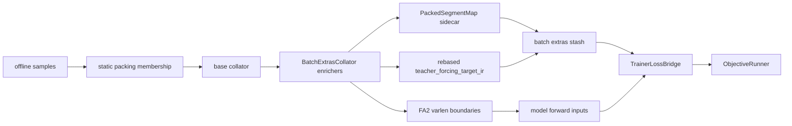

# Segment-Aware Packing V1 Design Spec

Date: 2026-06-07
Status: draft for approval
Scope: Stage-1 teacher-forcing training only; docs and implementation plan before code changes

## Purpose

Segment-aware packing V1 lets Stage-1 teacher-forcing training use long packed physical sequences while preserving the semantic independence of every logical sample segment. The target runtime should be close to the standard Stage-1 static-packing shape with a global max length near `12000`, but with sidecar supervision rebased correctly instead of silently treating packed rows as ordinary batch rows.

The expected win is higher correct training throughput under the same physical long-sequence budget. The comparison target is current correct unpacked Stage-1 teacher-forcing training versus new correct segment-aware packed teacher-forcing training.

## Non-Goals

V1 does not implement row-coverage packing, dynamic atom-density packing, same-base-image semantic grouping, multi-physical-row forward batches, Qwen2/Qwen2.5 support, logits projection, or generic mixed-objective packing.

V1 does not edit upstream Hugging Face model files, including `modeling_qwen3_vl.py`.

V1 does not expose a broad new public configuration surface. User-facing training config remains simple: `training.packing: true` with existing length controls.

## Core Principle

The semantic constraint is segment-correct packing, not same-base-image packing.

A logical segment is one independent causal training sequence. Segment-aware packing may place segments from different base images into one physical packed row if all segment boundaries, attention boundaries, position resets, image-token ownership, and supervision sidecars remain correct.

Same-base-image-only packing may exist as an optional debug or first validation mode, but it must not be baked into architecture as a semantic assumption.

## Physical Budget Contract

`training.effective_batch_size` remains the physical budget. Under packed training, it counts long packed sequences per optimizer step, not original logical examples.

With V1 staging, each per-rank forward/microbatch contains one physical packed row. The optimizer-step budget is reached through devices and gradient accumulation:

```text
physical_sequences_per_step =
  world_size * per_device_train_batch_size * gradient_accumulation_steps

V1 requires:
  per_device_train_batch_size = 1
  one physical packed row per rank forward
```

The global sequence budget is the existing max-length surface, for example `template.max_length: 12000` or the equivalent global max length used by the Stage-1 static-packing path.

## Supported Surface

V1 is supported only when all of these are true:

- Stage-1 teacher-forcing sidecar supervision is present.
- Static length-fill packing is enabled.
- Qwen3-VL-style model path is used.
- FlashAttention v2 is available and selected.
- The collator provides explicit varlen boundaries: `cu_seq_lens_q`, `cu_seq_lens_k`, `max_length_q`, and `max_length_k`.
- The forward uses full logits, not `logits_to_keep`.
- Each per-rank forward has exactly one physical packed row.
- All logical segments in a pack share a homogeneous supported supervision profile.

Unsupported surfaces must fail closed with explicit reason codes:

- row coverage sidecars
- mixed supervision profile packs
- ordinary SFT mixed with teacher-forcing sidecars in the same pack
- Qwen2/Qwen2.5 VL model families
- non-FlashAttention or unsupported attention implementations
- missing or inconsistent `cu_seq_lens_*`
- `logits_to_keep` or other sliced-logit paths
- multi-row physical forward batches
- dynamic packing modes not covered by static length-fill tests

## Architecture

V1 introduces one small sidecar abstraction, `PackedSegmentMap`, and keeps existing objective code mostly packing-unaware.



The packing membership engine remains the existing Stage-1/static length-fill path. V1 adds correctness metadata and sidecar rebasing; it does not invent a new sampler policy.

## PackedSegmentMap

`PackedSegmentMap` is compact batch metadata. It is not a model input and must not be forwarded into the model.

It must be built from the raw packed component samples plus the final collated tensors. The existing `dataset_segments` and `pack_num_samples` extras are not segment-span sources; `pack_num_samples` is only a sanity count, and current `dataset_segments` records per-physical-row lengths rather than per-component offsets.

It records:

- physical row count
- logical segment count
- per-segment source sample id
- per-segment source batch index before packing
- per-segment physical row
- per-segment token start offset
- per-segment token end offset
- per-segment length
- per-segment base image id or digest when available
- per-segment supervision profile
- per-pack support status and failure reasons

The map must be cheap enough to keep in batch extras and small logs. It must not duplicate `input_ids`, labels, logits, or full tensors.

## Teacher-Forcing Rebase

Current teacher-forcing supervision IR stores atom positions as row-local coordinates:

- `batch_index`
- `logit_position`
- `target_position`

When several logical examples are concatenated into one physical row, each logical atom must be rebased by its segment token offset:

```text
rebased.batch_index = physical_row
rebased.logit_position = segment.start + original.logit_position
rebased.target_position = segment.start + original.target_position
```

V1 must preserve logical sample ownership. The contract is one rebased `TeacherForcingTargetIR` per logical segment, with `sample_id` entries of the same length and a `PackedSegmentMap` mapping each logical sample id to its physical row. For the V1 one-row forward case, many logical sample ids map to physical row `0`.

The teacher-forcing supervision builder may become packing-aware enough to consume this map and emit a physical `SupervisionBatch` plus `sample_id_to_batch_index`. It must not overwrite rebased packed atom batch indices by using logical enumeration. `ObjectiveRunner` and `TeacherForcingObjective` should remain packing-unaware and only see physical coordinates and a correct row map.

The denominator for teacher-forcing loss is supervised atoms after remap.

## Attention and Position Contract

Strict causal isolation is mandatory. Each logical segment is one independent causal sequence, even if two segments share the same base image.

The FlashAttention v2 boundary contract is:

```text
cu_seq_lens_q = [0, len(segment_0), len(segment_0)+len(segment_1), total_length]
cu_seq_lens_k = cu_seq_lens_q
max_length_q = max(segment_lengths)
max_length_k = max(segment_lengths)
```

The model input must carry explicit `cu_seq_lens_*`. Transformers inference from `position_ids` is a fallback in upstream code, not the CoordExp V1 contract.

For Qwen3-VL, the final `position_ids` passed to the model are four rows:

- row 0: text position ids with resets at every logical segment
- rows 1-3: multimodal rotary position ids

The current `prepare_forward_inputs` path already combines `text_position_ids` with 3-row Qwen position ids for Qwen-family packed inputs. V1 must feed it coherent `text_position_ids` and `position_ids`, then validate the resulting 4-row contract.

## FlashAttention v2 Local Findings

Local environment checked on 2026-06-07:

- `transformers==4.57.1`
- `flash_attn==2.8.3`
- `ms-swift==4.2.2`

Relevant local code observations:

- Transformers FA2 helper accepts explicit `cu_seq_lens_q`, `cu_seq_lens_k`, `max_length_q`, and `max_length_k`.
- Transformers also has a position-id inference path, but upstream comments identify collator-provided cumulative sequence lengths as the ideal path.
- Qwen3-VL forward accepts `position_ids`, `cu_seq_lens_*`, and `logits_to_keep`.
- Qwen3-VL splits 4-row `position_ids`: row 0 is text position ids and rows 1-3 are multimodal rotary ids.
- Qwen3-VL applies `logits_to_keep` by slicing hidden states before `lm_head`.
- ms-swift packing enables both `template.packing` and `template.padding_free`; its SFT arguments require a FlashAttention implementation when packing or padding-free training is enabled.

V1 consequence: explicit FA2 varlen inputs are required, full logits are required, and `PackedSegmentMap` remains sidecar-only.

## Configuration Policy

No new broad public opt-in knob is introduced.

Expected user-facing config:

```yaml
training:
  packing: true
  packing_mode: static
template:
  max_length: 12000
```

Internal capability detection decides whether segment-aware remap is active. If `training.packing: true` is requested for a sidecar-bearing teacher-forcing surface, the training path should either:

- activate segment-aware packing for the supported V1 surface, or
- fail closed with explicit reason codes.

Optional debug or validation modes may exist internally or in developer-only configs, but the stable user-facing surface should stay simple.

## Observability

Every active segment-aware packed run must expose bounded support-status metadata:

- `segment_aware_packing_active`
- `segment_aware_packing_supported_surface`
- `unsupported_reason_codes`
- `validated_packs`
- `failed_packs`
- `failure_issue_counts`

Every active run should also report throughput and fill counters:

- physical packed rows
- logical segments
- base image count per pack
- row state count, when applicable
- supervised teacher-forcing atoms
- supervised teacher-forcing tokens
- text token count
- visual token count
- per-pack fill and slack

Candidate V1 throughput names should make the primary win semantics explicit:

- `supervised_label_tokens_per_second`
- `supervised_atoms_per_second`
- `logical_segments_per_second`
- `pack_fill_ratio`
- `padding_slack`

Failure artifacts must be compact, rank-0, bounded, and issue-oriented. They should not dump full tensors.

## Validation Gates

Implementation is not production-eligible until these gates pass:

- pure `PackedSegmentMap` construction and validation unit tests
- teacher-forcing IR rebase parity tests
- negative fail-closed tests for unsupported surfaces
- model-input bundle contract tests proving `packed_segment_map` is sidecar-only
- batch contract tests for explicit `cu_seq_lens_*`, text position resets, and `pack_num_samples`
- CPU objective parity: unpacked teacher-forcing examples versus one packed row with rebased IR produce matching loss numerator, denominator, and per-segment ownership
- one real non-skipped tiny Qwen3-VL FlashAttention v2 smoke run

The tiny Qwen3-VL FA2 smoke is mandatory before production-scale training claims. It can be hardware-gated in CI, but a skipped smoke leaves the implementation status as not production-eligible. The manual evidence must capture package versions, fixture/model id, command, and a non-skipped result exercising explicit `cu_seq_lens_*`, 4-row Qwen3 position ids, full logits, and finite loss.

## Stable Docs and OpenSpec Boundary

Current stable docs and specs should continue to describe the current fail-fast behavior for sidecar-bearing Stage-1 packing until implementation evidence exists.

After implementation evidence is collected, promotion to supported operator guidance requires stable-doc updates and an OpenSpec change if `training.packing: true` becomes supported for teacher-forcing sidecars. That promotion should cover:

- `packed_segment_map` sidecar semantics
- static-only V1 support
- full-logits requirement
- explicit FA2 varlen boundary validation
- unsupported-surface fail-closed behavior
- loss denominator semantics after sidecar remap
- metric and compact failure-artifact contracts, if they become normative

## Benchmark Policy

The official V1 throughput benchmark compares:

- current correct unpacked Stage-1 teacher-forcing training
- new correct segment-aware packed Stage-1 teacher-forcing training

Do not treat standard static packing without segment-aware sidecar remap as an algorithmic competitor for teacher-forcing sidecar surfaces. It is known wrong for this surface because target positions are not rebased.

Optional debug comparisons may include same-base-image-only or standard packing failure demonstrations, but those are validation/debug artifacts rather than candidate production algorithms.

## Approval Gate

This spec and the companion implementation plan are pre-implementation artifacts. Production code changes should not begin until the user gives final approval after review and refinement.
