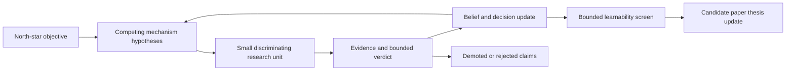

# Qwen3 Vision-Language Autoregressive Detection Research Compass

This page is the mutable program-level compass for the Qwen3 Vision-Language
(`Qwen3-VL`) dense-enumeration investigation. It records the north star,
current beliefs, strongest alternatives, next discriminators, and candidate
paper thesis. It does not own executed facts, runtime behavior, a final
architecture, or an implementation contract.

## Current Live Route

The [Human13 shared output-QP same-panel result](experiments/2026-08-31-human13-shared-output-qp-identity-generalization/results.md)
passes N2 `65 / 65`, N4 `123 / 123`, and N13 `392 / 392` at IoU50,
IoU60, and IoU80 under RP1.0 with zero hard debt, natural EOS, exact canonical
replay, and Source restoration. The later
[magnitude-only finite-overfit result](experiments/2026-09-01-human13-dora-magnitude-finite-overfit/results.md)
also compiles all `392 / 392` fixed-panel owners with a shared unmerged
language-DoRA magnitude surface. These are finite-panel programmability
results, not held-out transfer, semantic sharing, or population generalization.

The [fixed Image2299-payload transfer probe](experiments/2026-08-31-image2299-g46-payload-legacy12-transfer/results.md)
is strongly negative on legacy-12, and the
[Scalable Annotated-Owner Shared DoRA G0 result](experiments/2026-09-01-scalable-annotated-owner-shared-dora-pilot/results.md)
stops before gradients because its exact whole-bundle K1 null is infeasible.
The former rejects automatic reuse of that fixed payload; the latter closes
only its frozen control route.

The [Direct C-D0 result](experiments/2026-09-01-annotated-owner-direct-c-d0-pilot/results.md)
is mechanically valid but scientifically terminal. On the registered
128-image, 891-owner screen, D0 trails C by 24 IoU50 owners (`606` versus
`630`), retains `95.44%` of Source-covered owners, loses twice as many Source
owners as C (`28` versus `14`), and produces one cap where C produces none.
All four GO predicates fail. The frozen D0 bundle is not promoted or rescued;
this does not establish that shared DoRA or actual-prefix objectives cannot
work. The next bounded discriminator is a C-anchored zero-update mechanism
audit. Receding-horizon active-set projection remains conditional on that
audit. Production, architecture promotion, and tied-embedding updates remain
on hold.

### Earlier same-panel training lineage

As of `2026-08-13`, the completed [Human-13 On-Policy First-Bottleneck
Successor](experiments/2026-08-13-human13-on-policy-first-bottleneck-successor/results.md)
is the current evidence owner for native same-panel K-hit consolidation. Its
transactional vertical proves exact rollback. Its bounded pilot tests eight
aliases per arm across five owners and four images. All 16 one-update proposals
lose protected Source owners and are rejected, although each gains some K-hit
H owners; the selected target itself compiles only 9/16 times. Duplicate,
malformed, and row burden vary by candidate and objective, but owner exchange
does not. No checkpoint is promoted.

Therefore full-row CE is demoted for this route. First-bottleneck hinge is the
narrower primitive, but it is not safe at the tested fixed dose. If a new
successor is authorized, the smallest discriminator is an adaptive/lower-dose
first-bottleneck update or explicit owner-preserving objective; another suffix
alias under the same update is no longer the primary uncertainty. It must keep the
direct clean-greedy gate and cannot infer safety from net recall or a gradient
watch.  The completed K-union and row-contrast screens remain the static
substrate.  This is overfit-only evidence, not checkpoint promotion,
validation, or architecture authority.

As of `2026-08-12`, the separate interrupted-checkpoint [Owner Bridge Step-611
Natural-Decode Recall Probe](experiments/2026-08-12-owner-bridge-step611-recall-probe/results.md)
is the current evidence owner for the permanent OwnerBridge checkpoint only; it
does not replace the source-specific causal lineage below. The bridge-bound
human-refined 12+2299 screen is a behavioral `HOLD`: legacy-12 recovers 7
class+IoU50 owners over 346 GT, image 2299 recovers none over 46, and every
final route remains non-null at the saturated admission cap before native EOS.
This rejects a missing-bridge explanation and routes any authorized successor
to the final-boundary route-to-opener admission seam, not another broad eval or
new training launch. The already-completed val200 run is supplementary
prevalence evidence only; the 13-image screen was sufficient.

As of `2026-08-06`, the completed no-training [Static-Dynamic Owner Interface
Crossover result](experiments/2026-08-05-static-dynamic-owner-interface-crossover/results.md)
is retained with a bounded S technical HOLD and the [prior-evidence semantic
audit](experiments/2026-08-06-natural-boundary-routing-history-replication/prior-evidence-semantic-audit.md).
Its A3 step-2445 `gt:2299:2` K10 switch is narrowed to
`post_opener_conditional_oracle_routing_sufficiency`: the target-exclusive
query-to-image arm releases target owner `2` after a supplied row opener, but
does not test spontaneous admission or STOP. D10/D20 pre-opener scalar changes
are row-entry grammar effects; their seeded conditional owner identity is
null. The old Y10/Y11 rows are parser-valid but physical-owner unmatched, so
the source-specific crossover is unqualified and any matched `tau=0` is
descriptive and non-authoritative.

As of `2026-08-07`, the current evidence owner is the completed [S K10-H20
Natural Crossover result](experiments/2026-08-07-s-k10-h20-natural-crossover/results.md),
standing on the completed [S-Primary Natural-Boundary Static Routing and
History Admission Replication result](experiments/2026-08-06-natural-boundary-routing-history-replication/results.md).
S four-coordinate `geo_sorted_xy` step-2444 remains the only decision-owning
substrate.

The 2026-08-06 unit completed after its serialization-only successor. Gate v3
ran on `gt:5001:15` across all fifteen arms, and the K/N/H cohort executed over
eight shards and was sealed. Over `11` events and `8` images, K10 hard
B-exclusive target release is `4/11` on `4` images, which clears the frozen
checkpoint floor and qualifies the static direction as **oracle routing and
target transcription sufficiency only**. H20 is `9/11` factor-qualified and
`2/11` grammar-disruptive; H10, N10, and N20 are `0/11` qualified; no native
STOP occurs in any arm of any event; K14 finite salience qualifies on `1` event
and `1` image and is `HOLD`. `training_claim_status` is `hold`. The immutable
v1/v2 `gt:5001:15` failures remain technical, not admission, STOP, routing,
history, or owner-selection nulls.

The 2026-08-07 crossover unit executed once and completed. Its evidence is
artifact-valid but the source-specific crossover is `unqualified`, and formal
aggregate `tau` and both utility horizons are **null, not zero**. It is
conditional case-level evidence on `3` events and `3` images selected as the
K10-positive, H20-qualified, non-degenerate intersection; it is not checkpoint
crossover prevalence or effect. The fresh implementation reproduced `9/9`
source `K01`/`K10`/`H20` endpoint vectors, so its K10 target release `3/3` is
deterministic cross-implementation replication of the selection condition, not
efficacy and not a base rate. C11 reproduces K10's target release at `2/3` and
is endpoint-vector-identical to C10 there; at `gt:2299:29` it suppresses
natural admission — first token `291`, opener rank 4 at log-probability
`-6.34561` — so no row starts. That is a single-event admission interaction,
not a checkpoint-level history route. A non-null aggregate tau was structurally
impossible before launch because the source baseline and K10 unmatched counts
were already known; this is recorded as a retrospective design and power
failure, with no retry.

A3 step-2445 remains optional secondary evidence, is `DO NOT RUN`, and does not
inherit decision authority: S's `row_contract` has `commit_token_id: null`, so
no commit-wrapper-specific attribution question exists. P4 is `DO NOT RUN`. No
sweep, retry, re-selection, or new crossover is authorized.

No probe GPU is active. Training, A2, wrapper/token changes, architecture
promotion, decoding changes, and production launch remain unauthorized. Any
training route remains a separate later decision.

Both S natural-boundary units are closed and **documentation-certified**. A
read-only formal scientific audit returned `PASS` on evidence integrity with an
initial `HOLD` on unit closure; its documentation-only remediation was applied
and the independent Fable post-remediation re-review returned `PASS`. The
2026-08-06 support-completion lineage received a separate read-only audit
returning `PASS` (`P0 = 0`, `P1 = 2`, `P2 = 5`): `200` frozen native-FN
contexts, eight shards with exact assignment and order, realized `= expected =
77,428` scalar forwards with `resumed = 0`, `support-merge-v6` authoritative,
and `14` verified native-FN owners narrowing to the `11` admitted events by a
support-blind geometry predicate. Shard-6's earlier roots are unattested
transport deaths, so its user-authorized supervised rerun consumed no exact
scientific repair allowance. Two field-scope traps carry forward: read
`verified_S_count = 14` rather than a disposition tally, and note that `14` is
native-FN-scoped while the census holds `26` S owners with verified support.
None of this promotes any mechanism.

The immediately preceding evidence owner was the completed [Sorted Crossing
Matched-Length Neutral-Row Insertion Control
result](experiments/2026-08-04-sorted-crossing-matched-length-neutral-row-insertion-control/results.md).
Its frozen route was `neutral_row_not_neutral_inconclusive`: the selected
covered-row control was material on `8/12` specificity owners, and the damage
tracked sorted-route regression distance. A lower-regression control was
feasible for only `5/12` specificity owners, so that insertion line is closed
and retained as historical evidence, not the current treatment.

Fresh sessions start from the completed crossover [result](experiments/2026-08-07-s-k10-h20-natural-crossover/results.md),
[unit](experiments/2026-08-07-s-k10-h20-natural-crossover/unit.md), and
[review](experiments/2026-08-07-s-k10-h20-natural-crossover/review.md), then the
completed S-primary [result](experiments/2026-08-06-natural-boundary-routing-history-replication/results.md)
and frozen [unit](experiments/2026-08-06-natural-boundary-routing-history-replication/unit.md),
its [prior-evidence semantic audit](experiments/2026-08-06-natural-boundary-routing-history-replication/prior-evidence-semantic-audit.md),
and the completed static-dynamic [result](experiments/2026-08-05-static-dynamic-owner-interface-crossover/results.md)
and [unit](experiments/2026-08-05-static-dynamic-owner-interface-crossover/unit.md) as bounded lineage, then its transport [handoff](2026-08-05-static-dynamic-owner-interface-probe-handoff.md), the
prospective thirteen-image admission, the neutral-row result/review, geometry
result/review, crossing-boundary result, prevalence result, and invalid full-
canvas result. The following older formal owners remain useful for the broader
history:

1. the completed [Source versus transition step-36 forced-opener owner-selection
   result](experiments/2026-07-26-source-versus-transition-step36-forced-opener-owner-selection/results.md),
   which owns the same-boundary checkpoint contrast, gate-versus-selection
   decomposition, bounded visual review, and claim boundary;
2. its frozen [execution
   unit](experiments/2026-07-26-source-versus-transition-step36-forced-opener-owner-selection/unit.md),
   which owns the checkpoint identities, paired estimand, controls, and
   no-training stop rule;
3. the completed [paired natural-terminal native versus forced-opener one-row
   release
   result](experiments/2026-07-25-paired-natural-terminal-forced-opener-release/results.md),
   which owns the 200-boundary causal recovery result, paired control, outcome
   audit, and claim boundary;
4. its frozen [execution
   unit](experiments/2026-07-25-paired-natural-terminal-forced-opener-release/unit.md),
   which owns the exact one-token intervention, panel, estimand, controls, and
   no-training stop rule;
5. the completed [untouched natural-terminal boundary statistical-analysis
   result](experiments/2026-07-25-untouched-terminal-boundary-statistical-analysis/results.md),
   which owns the 200-boundary composition, paired-margin, stratified, and
   sensitivity evidence and the next release-study estimand;
6. its frozen [execution
   unit](experiments/2026-07-25-untouched-terminal-boundary-statistical-analysis/unit.md),
   which owns the read-only protocol, fixed panel, and no-release stop rule;
7. the completed [continuation-shift locality and exact-prefix remaining-owner
   compositionality
   result](experiments/2026-07-25-continuation-locality-and-exact-prefix-owner-compositionality/results.md),
   which owns the broad-continuation, sampled-reachable owner-recovery, and
   one-step composition evidence and its claim boundary;
8. its frozen [execution
   unit](experiments/2026-07-25-continuation-locality-and-exact-prefix-owner-compositionality/unit.md),
   which owns the bounded no-training protocol and stop rule;
9. the completed [existing-checkpoint transition mechanism decomposition and
   robust-evaluation
   result](experiments/2026-07-25-existing-checkpoint-transition-mechanism-decomposition/results.md),
   which owns the four-lane Phase Zero evidence, mixed mechanism judgment,
   claim boundary, and discussion-stage next-training recommendation;
10. its frozen [execution
   unit](experiments/2026-07-25-existing-checkpoint-transition-mechanism-decomposition/unit.md),
   which owns the no-new-training protocol and stop rules;
11. the completed [prefix-local and on-policy final owner-set training
   unit](experiments/2026-07-24-prefix-local-and-on-policy-owner-set-training/unit.md),
   which owns event materialization, the compared objectives and controls, the
   completed long training, matched training-panel comparison, and narrow
   transition-step-36 development/held-out transfer gate;
12. the completed [trajectory owner-set admission-census
   result](experiments/2026-07-23-trajectory-owner-set-admission-census/results.md),
   which owns the executed `8/2,004` strict-composite finding and its bounded
   claim; and
13. the [experiment index](experiments/index.md), which owns lifecycle routing
   across units.

The strict 248-additional-admission estimand remains blocked before entropy
because it does not answer the active broader prefix-level design. The active
route preserves the original `list all objects` prompt and one-completion
output contract; the external one-row-at-a-time prompt or textual covered-set
branch is pending and not part of this route. Handoffs, agent-review outputs,
reviewer packets, audits, and memory notes remain historical provenance only;
none is a live route target.

As of `2026-07-26`, the same-boundary Source-versus-transition step-36
forced-opener comparison is complete. With the continue decision fixed, both
checkpoints recover `45/200` strict uncovered owners: transition gains two,
loses two, retains 43, and has owner net zero. The two gains are genuine
owner-selection or valid-geometry improvements; the two losses retain the same
visible entity but degrade geometry below the strict match threshold.
Transition native release nevertheless produces 16 strict owners versus
Source native release's one and stops immediately on 155 rather than 198
boundaries. The main measured step-36 effect is therefore a continuation-gate
shift, not aggregate conditional-owner creation. The earlier Source-side
visually grounded unmatched recovery cannot be attributed to recent training.
The result does not establish a production continuation policy, downstream
trajectory utility, new training objective, or architecture. The route is
paused for a fresh architecture-level reassessment. The user has held both the
geometry-preserving continuation successor and the longer forced-trajectory
successor pending independent Pro/Faber analysis and a new discussion. Reviews
remain advisory; no experiment follows automatically.

The preceding two-discriminator continuation-locality and exact-prefix
owner-composition unit is also complete. Continuation changes are nearly equal
at trained, same-image-near, and untouched nonterminal boundaries; natural
terminal states attenuate but do not remove the shift. In the sampled-reachable
400-case atlas, Source recovers `362/400` owners natively, opener forcing adds
only the sole actual-stop recovery, and complete-description forcing reaches
`387/400`. The 38 ordered owner pairs retain heterogeneous short-horizon
sequential compatibility even though the second fixed candidate row usually
becomes less likely after the first row is appended.

The prior four-lane existing-checkpoint Phase Zero is also complete.
Heldout remains `46 gained / 39 lost / +7 net` under robust token-cutoff,
natural-stop, leave-one-image-out, and matching-threshold checks; arm-blinded
entity and geometry review retains `22 genuine gains / 16 genuine losses / +6`.
On seven selected exact Source prefixes, step 36 raises continue-minus-stop on
all seven and improves best-uncovered minus best-covered row likelihood on five
of six comparable cases, but neither actual Source terminal state flips and
released row realization does not improve. The complete-row arms contain owner
signal by 256 tokens, yet their dominant failure is excessive continuation and
output expansion rather than sum-versus-mean normalization.

The [weekly integrated research
report](2026-07-13-to-2026-07-16-weekly-research-report.md) is the compact
supervisor snapshot of the executed sequence summarized by this compass.

Executed facts remain in experiment `unit.md` and `results.md` records. The
[investigation overview](overview.md) owns the detailed evidence atlas and
hypothesis decomposition. [Research decisions](../../decisions/) own current
route choices. A mechanism is not promoted to [Mechanisms](../../mechanisms/)
until independent units support it and a novel prediction succeeds.

## North-Star Objective

Determine whether the pretrained Qwen3-VL model can be trained to enumerate
the complete supported Common Objects in Context 80-category (`COCO-80`) object
set through deterministic greedy autoregressive generation, while preserving:

- object phrase and geometry binding;
- precision and low unsupported-hallucination behavior;
- unique-object coverage rather than repeated hits;
- valid structured rows and natural termination;
- the model's pretrained visual, language, and one-shot detection capability.

The immediate research target is to convert object support that is currently
dispersed across stochastic rollouts and prefix-conditioned trajectories into
a safe greedy traversal. This is an objective, not an established capability.

## Current Treatment Gate

The completed [Constant-Dose Image-Breadth Treatment
Screen](experiments/2026-07-22-constant-dose-image-breadth-treatment-screen/results.md)
closes the current positive-only complete-row scale-up branch. With 992 events,
31 updates, two matched training seeds, and exact object-count-band by
selection-rank matching, spreading supervision over 496 images does not beat
concentrating the same dose in 162 nested images on the pre-admission held-out
cohort. Broad minus concentrated is `0/-12` by seed at Intersection over Union
0.30 and `-3/-10` at 0.50 under the primary repetition-penalty-1.0 policy; both
paired uncertainty intervals include zero.

The negative transfer result does show that owner-directed credit actuates
locally; it does not establish that optimization strength, transfer, or native-
state accessibility are sufficient. On gradient images, sampled-route event
owners missed by Source are
recovered approximately 36 to 41 percent of the time, versus approximately 8
to 12 percent for non-selected missed owners. Source-preservation events retain
approximately 95 to 97 percent of the Source owners they explicitly name. The
enrichment is consistent with owner-specific uptake, but it is not a same-owner
untreated counterfactual. The current loss still does not specify how to gain an
owner while preserving the value of the complete final owner set.

The separate repetition-penalty-1.10 panel also changes the research boundary.
It exchanges roughly 65 to 100 owner identities per arm and seed relative to
repetition penalty 1.0, usually without improving absolute owner count. It is a
trajectory intervention, not a harmless duplicate-only adjustment, and must
remain frozen and reported separately in future comparisons.

The user has now corrected the next treatment boundary twice: first away from
one selected row, then away from requiring every training image to satisfy the
census's strongest natural-alias strict composite. The active unit keeps final
unique-owner coverage as the decision-bearing outcome while comparing several
non-exclusive credit mechanisms:

```text
image plus an actual model-produced prefix
  -> recover the verified covered-owner set through that action boundary
  -> raise one verified uncovered owner only relative to confirmed non-progress
  -> leave other valid uncovered owners and unresolved rows out of its negatives
  -> compare that local objective with exact-prefix pairwise training
  -> separately optimize trusted final owner-set utility on fresh policy rollouts
  -> combine local and final-set credit only after both pass their own checks
  -> evaluate the original one-prompt, one-completion clean-greedy owner set
```

Strict final-set edges and natural order aliases remain strong evidence strata,
not universal event-admission requirements. Local actuation is not success: the
promotion gate is a net gain in final trusted physical owners under the original
prompt and completion contract. Object slots, a coverage carrier, an external
detector, terminal suppression, textual covered-set prompting, and inference-
time control remain unselected or pending.

## Working First-Principles Model

Ideal enumeration resembles weighted selection without replacement. If
`U_t` is the set of reportable objects not yet committed at object step `t`, a
successful transition must:

```text
choose one object from U_t
  -> bind one phrase and one geometry to that object
  -> commit the emitted object
  -> remove or suppress that object
  -> redistribute probability toward U_(t+1)
  -> stop only when no supported object remains
```

The current model has no proven explicit `U_t`. Its text prefix and cached
language-model states must jointly approximate traversal, commitment, and
remaining-object state. Repeated full-image sampling may therefore expose
object support that exists in the model distribution without proving that one
greedy trajectory can cover it safely.

## Research Graph



Markdown links, rather than this diagram, are the durable graph edges.

## Non-Negotiable Research Commitments

1. Measure selection, row transcription, commit or coverage, and termination
   separately before combining them into one explanation.
2. Require correct-object interventions to outperform wrong-object,
   source-swapped, token-permuted, position-only, and norm-matched controls.
3. Use same-prefix controls before attributing a result to next-object
   competition, and same-feature controls before attributing a result to the
   language-model side of the visual-language boundary.
4. Treat unmatched predictions under incomplete annotations as unresolved and
   classify them on two separate axes. The entity and category axis is:
   unlabeled true positive, duplicate, semantic error, entity hallucination, or
   uncertain. The geometry axis is: acceptable geometry, localization error,
   instance-binding or neighbor-contamination error, or uncertain. Never infer
   hallucination from official mismatch alone. Cross-category overlap requires
   crop-enlarged inspection rather than automatic rejection.
5. A training improvement must preserve native one-shot capability and cannot
   be promoted solely because it produces more rows or slightly more recall.
6. Architecture follows passed causal gates. Slots, a persistent ledger, a
   cursor renderer, a fixed bridge layer, and a final forward pass remain
   unselected.
7. A 256-image training screen is evidence about learnability, not a final
   quality estimate or scale claim.
8. A mechanism claim must survive semantically equivalent physical batch
   execution before it is treated as an intrinsic model capability.

## Current Evidence Boundary

### Verified or bounded-supported

- Pixel-level full-canvas spatial restriction changes which object is rescued
  in one seed-matched opportunity, but the final masked policy does not safely
  outperform equal-call full-image bagging.
- Full-image bagging exposes additional unique object support, but also produces
  highly correlated repetition, fragmentation, category disagreement, and
  some true hallucination. It is a diagnostic and candidate source, not an
  accepted final policy.
- The complete cumulative accepted-row prefix policy is harmful relative to
  reset. That intervention bundles length, content, errors, order, and visual
  consistency, so a token-length-only mechanism is not established.
- Painted and post-scatter visual designation can causally control a selected
  object row in bounded probes.
- The tested split-layer proposal bridge behaves mainly as a non-specific
  continuation pulse rather than source-specific object control.
- Native prefix state produces a content-sensitive short-term transition, but
  no stable order-free object ledger has been demonstrated.
- Native complete sibling rows from exact shared parent prefixes causally alter
  the immediate successor distribution. One row-zero bowl-carrot state passes
  strict reciprocal crossover across all 231 exact-row pairs and reproduces
  under full-model 32-bit floating point, while image `12576` and image `7574`
  reject reciprocity and one dense-person state is refused. The positive boxes
  are nearly nested, so this establishes executable row-conditioned successor
  state, not a general physical-object covered set.
- Exact full-row scoring on a fresh image-`2299` native chain adds a cleaner
  same-category result. Appending person B after person A lowers B's own frozen
  row by `-6.2517` summed natural-log units and raises four frozen rows owned by
  two other people by `+1.3919` to `+2.4343` in full-model `float32`. The change
  is concentrated at `x1`; descriptions are all `person`, and continuation
  margins stay above `11.0`. This establishes a local geometry-structured
  successor transition, not probability conservation or an object ledger.
- Repeated one-row sampling from the same image-`2299` boundary remains highly
  concentrated: person B appears in 153 of 160 independent samples. Two rare
  alternative owners appear twice each and three rows are unmatched, but no
  alternative owner passes the predeclared three-distinct-variant gate. The
  reciprocal equal-depth test is therefore unidentified, and layer tracing and
  training remain closed.
- No non-greedy sibling provides a positive, safety-preserving Greedy
  Branch-Value Gap at Horizon Four across the three released states. Native
  sibling selection changes trajectories, but this panel supplies no
  branch-value training target.
- A human-resolved extension on image `2299` reaches the same decision under a
  stronger natural-prefix test. Across four natural third-row people and eight
  paired seeds per arm, the greedy branch yields `3.500` uniquely matched new
  people over the next four rows. The three sampled-only branches yield
  `2.875`, `2.250`, and `3.125`; none has a positive paired value gain. The
  alternative branches remain real and non-repetitive, but they more often
  enter weakly localized `tie` output. This closes sampled-row novelty as a
  direct preference-training target without closing all loss-only calibration.
- The missing random-order person-25 treatment is now closed on image `2299`.
  Appending three distinct raw person-25 rows moves sampled output into the
  overlapping person-18 corridor, and a natural control trajectory reproduces
  the same immediate transition after it emits person 25. This is not an
  atomic object switch: the clean and merged continuations share description
  and their first three coordinates and separate mainly at `y2`. At the exact
  greedy prefix, single-token `coord_999` has the highest logit, while the
  person-18 boundary band `514..576` owns `49.54%` of full-vocabulary
  probability after temperature `0.4`. Putting person 18 in an earlier row
  reduces but does not prevent its return (`55/96`) and introduces 12
  full-canvas boxes. This supports a geometry-conditioned transition with
  strong dependence on the most recent row in this case, plus fragmented valid
  coordinate mass, not a stable covered-object ledger. See
  [Person 25 Dominant-Owner Commit and Persistence Closeout](experiments/2026-07-18-person25-dominant-owner-commit-and-persistence-closeout/results.md).
- A six-case crop-reviewed geometry-sorted replication separates three
  within-row failure families. Image `15335` has an independent top-boundary
  error while later coordinates remain on the same person; image `7574` shows
  a small early coordinate branch amplifying into a truncated bowl extent; and
  image `16451` is better explained by a low-probability tail plus
  ontology-sensitive umbrella extent. Raw physical-boundary mass exceeds the
  isolated coordinate argmax in all three primary focus states, but the tight
  cluster survives the source top-p cutoff clearly in only one, so the
  predeclared combined gate fails. Same-class controls show that physical
  ownership can remain unresolved beyond `x1`. This keeps a bounded
  coordinate-and-whole-row calibration question open, but does not promote an
  independent-coordinate decoder or a new state carrier. See
  [Fixed-Prompt Clean-versus-Degraded Coordinate Branch Replication](experiments/2026-07-18-fixed-prompt-clean-versus-degraded-coordinate-branch-replication/results.md).
- The matched-objective follow-up prevents that six-case result from being
  promoted directly into another coordinate loss. Fixed-prefix scoring shows
  that the scoring checkpoint, rather than prefix source alone, determines the
  bowl, umbrella, and bus coordinate modes. A final 96-rollout Gaussian
  replication using the exact current sampler preserves the bowl `y2` spread
  and one dense-person branch failure, but reduces the historical bus-wide
  spread to a stable left-boundary preference. Pure cross-entropy also wins the
  existing matched validation-200 comparison. Use pure cross-entropy as the
  next mechanism baseline and keep Gaussian smoothing plus Ranked Probability
  Score as an ablation. See
  [Matched-Objective Coordinate-Branch Signature Comparison](experiments/2026-07-18-matched-objective-coordinate-branch-signature-comparison/results.md).
- The same-covered-set order probe closes a previously missing comparison on
  image `2299`. With complete prefix rows, physical covered set, row count,
  final row, model, prompt, and paired seeds held fixed, exchanging two earlier
  rows changes the next physical owner in two of four cases. A separate case
  produces person rank 6 in all nine runs when its row is omitted and in zero
  of eighteen runs when its row is present, independent of the exchanged
  order. This supports a hybrid behavior: local covered-owner suppression can
  coexist with path-sensitive competition among uncovered people. It does not
  show that path dependence harms later set completion, and the symmetric
  removal of the second exchanged owner remains unexecuted. See [Same Covered
  Physical-Object Set under Different Earlier Prefix Orders
  Results](experiments/2026-07-19-same-covered-set-prefix-order-equivalence/results.md).
- Full-model 32-bit floating-point candidate scoring now identifies where
  selected route effects enter. Image `18380` first flips `person` versus
  `cup`; conditional on `cup`, it raises one uncovered cup row by `+1.1640`
  summed natural-log units almost entirely at `x1`, while making a covered cup
  slightly worse. The later image-`19109` route states reorganize same-
  description motorcycle geometry mainly at `y1`, but they also contain
  different generated histories and do not isolate order alone. Image `9590`
  shows that a sampled terminal output can occur while raw row-start remains
  more likely and all supplied candidate rows remain nearly unchanged.
  Complete-row sums also fail to predict the actual greedy branch in selected
  cases: the earliest distinguishing token is the operative decision point.
  Prefix state therefore redirects physical candidates in bounded cases, but
  not through one universal terminal, description, coordinate, complete-row,
  or covered-set rule. See
  [Complete Candidate-Row Score Decomposition
  Results](experiments/2026-07-19-complete-candidate-row-score-decomposition/results.md).
- The matched step-`4,887` ordering-policy pilot now rules out the simple claim
  that random complete-row order teaches useful order-free coverage. On the
  near-complete image `2299`, the random-order checkpoint sends every order and
  leave-one-out arm to person rank `18`; this is one habitual route, not a
  covered-set state. The geometry-sorted checkpoint preserves more route
  diversity but also remains order-sensitive, and neither checkpoint passes
  symmetric leave-one-out coverage. Candidate scoring localizes the clean
  image-`18380` geometry-sorted switch first to `person` versus `cup` and then
  to cup `x1`; selected random image-`19109` switches cross much smaller local
  category margins. Row start strongly dominates terminal output throughout.
  Strict owner matching is available for only `103 / 240` geometry-sorted
  outputs versus `201 / 240` random outputs, so raw activation counts cannot
  rank checkpoint sensitivity. Geometry-sorted pure cross-entropy is the
  pragmatic base for a small local transition-calibration screen; random
  ordering remains an ablation, not a treatment. See [Matched Random-Order-
  Trained versus Geometry-Sorted-Trained Prefix-Order Screen
  Results](experiments/2026-07-20-matched-random-sorted-prefix-order-screen/results.md).
- The resulting first-wrong-coordinate Smoke B now separates local
  learnability from end-to-end treatment value. Two optimizer steps on eight
  reviewed events improve the frozen accepted-coordinate-versus-wrong-token
  margin on four of five held-out events relative to both source and the
  learning-rate-matched token-type-gate control. The gain does not survive as
  a stable free-rollout advantage. On the three held-out images, neither
  coordinate arm improves matched-box Intersection over Union relative to its
  matched control, and both create substantially more unmatched and duplicate
  candidates. The gate-only `1e-5` arm is the strongest ordinary-rollout arm
  on the eight-image smoke. The local coordinate objective is therefore a
  valid diagnostic and was not promoted by that smoke alone. A later user-
  authorized 256-image successor is recorded below. See [Smoke B First-Wrong-
  Coordinate Calibration
  Results](experiments/2026-07-20-own-prefix-entity-transition-and-coordinate-boundary-calibration-training-screen/smoke-b-v1/results.md).
- The completed 256-image successor confirms local learnability and rejects
  the tested end-to-end treatment. Exact source-prefix float32 margins improve
  in `242 / 256` events at learning rate `1e-5` and `241 / 256` at `3e-6`,
  spanning all four coordinate positions. Clean rollout on the same 256 images
  does not improve at either learning rate. The lower learning rate reduces
  format and length disturbance but still lowers Mean Average Precision.
  Selected-coordinate error can improve while the intended row category or
  full box becomes worse. The result isolates a fixed-prefix-to-own-prefix
  transfer or parameter-entanglement problem; it does not justify a larger
  learning-rate sweep, 1,024-image training, or full-data training. See [256-
  Image Coordinate-Boundary Training Screen](experiments/2026-07-21-256-image-coordinate-boundary-training-screen/unit.md).
- The sampled-history reachability unit now closes the direct path from bagged
  novelty to complete-row preference training. Exact sampled prefixes make
  later targets greedily reachable in several images, but access can be
  non-monotonic. Three same-parent natural rows that name the same physical
  owner and differ only in coordinates all redirect later owner access. Only
  image `7816` preserves a safe final gain, from nine to ten strict unique
  owners; images `12576` and `18380` exchange owners. On image `7816`, sampled
  `x1` or sampled `y1` in row 4 is individually sufficient for the rescued
  route, while reverse and orthogonal controls produce unmatched hybrid boxes.
  On image `12576`, neither sampled row 3 nor sampled row 4 is sufficient alone;
  their joint history is required after two common rows. Prefix geometry is
  therefore causally executable route state, but not a demonstrated monotonic
  object ledger, universal latest-row carrier, or safe training target. See
  [Sampled-History Target Reachability and Complete-Row Causal Value
  Results](experiments/2026-07-19-sampled-history-target-reachability-and-complete-row-value/results.md).
- At exact prefix state 56 on image `12576`, repeated one-row sampling exposes
  two valid object modes: the target pizza and a competing left cup. The same
  target disappears at the greedy-terminal state; an independent chair case
  reproduces the rescue-entry-versus-terminal state contrast.
- One source-specific first description token can carry a matching phrase and
  box through a complete row. This establishes description-conditioned
  within-row binding, not a visual instance pointer.
- The exact phrase-geometry factorial rejects phrase-only, geometry-only, and
  uniform complete-row advancement explanations at Prefix State 56 (`P56`).
  Only a coherent `cup` plus left-cup geometry row advances to the right cup.
  This supports a bounded phrase-and-geometry compatibility gate, not yet a
  visually grounded commit or order-free ledger.
- The right-cup successor at that exact state survives both selected local
  post-vision left-cup support replacement and complete pre-vision raw
  left-cup bounding-box donor replacement in greedy decoding and all eight
  paired samples. This disfavors a behaviorally necessary local
  committed-object visual revalidation gate without proving visual
  independence.
- On image `7574`, crossed phrase-geometry rows cause the decoder to
  re-identify the physical object at the supplied geometry. However, the exact
  coherent white-bowl prompt repeats the white bowl at physical batch size one
  and advances to an orange bowl at physical batch size four. The result is
  independent of a `16`- versus `512`-token maximum generation horizon and
  localizes the instability to same-class first-coordinate selection.
- Across six selected complete-row transitions, physical batch shape changes
  exact `bfloat16` continuation tokens in every case and the first action in
  three cases. The three first-action changes remain on the same object and
  differ by only one or two source-image pixels; full-model `float32` removes
  every promoted difference. Recurrent numeric sensitivity is therefore
  supported, while a recurrent material object- or coordinate-basin switch is
  not.
- At the exact first differing slots of those three cases, both repeats
  reproduce the `bfloat16` split with zero same-layout noise, but complete-
  vector shifts remain only `4.17%` to `6.22%` of the earlier broad anchor and
  every selected bin stays inside one object neighborhood. Exact-recipient
  `float32` attenuates the batch-layout shift by `5,342` to `11,278` times.
  Layer escalation is closed for these micro-splits without claiming global
  numerical invariance.
- With one exact full-image visual encoding and fixed base prefix, hard
  post-vision image-token key eligibility causally changes later description
  and coordinate likelihoods. One of five valid cases completes a regional
  semantic-plus-geometry owner switch; one switches geometry without semantic
  ownership; three remain one-sided or destructive. The seam is real, but a
  recurrent whole-row instance pointer and general competition release are not
  established.
- Finite decoder-wide positive spatial-key bias at `0.5`, `1.0`, and `2.0`
  strongly and dose-dependently changes later row likelihoods on four retained
  anchors, but yields zero complete-row or geometry owner reversals. Hard
  eligibility's positive cases arise mainly from nonlinear non-owner collapse,
  so mild context-preserving attention preference is not a sufficient owner-
  binding operator on this panel.
- Row-scoring-query-only hard eligibility is sufficient for geometry and
  same-category spatial-owner switching in selected cases, but it does not
  reproduce image `139`'s cross-category semantic-plus-geometry all-query
  phenotype. Some earlier-query computation is required for that phenotype;
  its locus and interaction with the direct row read remain unresolved.
- In the image-`139` earlier-query-by-row-query factorial, earlier-only
  restriction has almost no regional crossover, while row-only restriction
  carries geometry routing. The large all-query cross-category description
  crossover appears only for matched earlier and row regions and is driven
  mainly by collapse of the competing row. This supports phase-separated
  compatibility or competitive exclusion, not an earlier-only object compiler
  or a localized causal mediator.
- In the image-`139` crossed-region hybrid, both earlier and row-scoring regions
  affect the first semantic token, while aggregate geometry-margin sign follows
  the row-scoring region. Clock-Earlier and Vase-Row forms a pairwise clock-
  phrase and vase-geometry chimera; the reverse hybrid's top first description
  token is `person`, so symmetric phrase-geometry handoff is falsified. Both
  complete-row margins become nearly neutral, and constructive geometry
  activation occurs only in the vase-row direction.
- At the cardinality-derived finite soft bias `3.9060049`, the matched vase arm
  predicts `clock` and favors clock geometry, while the matched clock arm
  materially suppresses its preferred clock geometry owner. The execution is
  valid, but the matched-control gate fails; the crossed arms are therefore not
  interpreted, and this operator is closed as an adjudicator of the hard
  crossed-region result.
- One eligible image-`139` clock-description path retains approximately `98.4%`
  of its persistent hard-routing release after one layer-`23` returned-state
  replacement. The image-`632` geometry anchor is control-only: hard routing
  adds `+2.329` to `+2.544` natural-log units per coordinate, but donor
  Intersection over Union (`IoU`) remains `0.000` to `0.018`. This supports
  bounded semantic confidence portability and coarse coordinate actuation,
  not donor-owned geometry or a combined phase-specific controller.
- A follow-up eligibility screen finds two tight, instance-owned persistent-
  hard geometry paths on each of three clean resolution-qualified images. On
  the frozen image-`7818` successor, the paired `wine glass` donor state after
  decoder block `23` switches the unrestricted owner from annotation `664730`
  to `661523` with donor Intersection over Union (`IoU`) `0.800259`; the trusted
  block-`13` control does not switch. The teacher-forced effect is almost
  entirely at `x1`, supporting bounded one-way first-coordinate geometry-basin
  portability rather than a portable full-box object representation.
- On S `geo_sorted_xy` step-2444 at the exact natural pre-opener boundary, hard
  B-exclusive image-key restriction supplied from ground truth releases the
  strict physical target owner on `4/11` cohort events over `4` images, which
  clears the frozen checkpoint floor. This establishes **oracle routing and
  target transcription sufficiency only**. It is not a natural owner slot, an
  owner field, a covered-set pointer, or a trainable soft routing mechanism.
  Target selection and general owner grounding stay distinct: in the
  three-event crossover follow-up every K10 cell carried exactly two
  physical-owner-unmatched rows and matched count fell in `2/3` events.
- Natural-boundary history ablation on this substrate is factor-qualified only
  for the latest completed row (H20, `9/11`); H10, N10, and N20 are `0/11`
  qualified and predominantly grammar-disruptive. H20 degrades opener
  confidence at every event of the three-event follow-up and flips the opener
  at none. Its owner effect varies in sign, and at `2/3` of those events the
  latest row is the entire admitted history, so recency-only attribution rests
  on a single event.
- Simultaneous `K10 ∧ H20` at the natural boundary produces no separable
  routing effect: it is endpoint-vector-identical to K10 alone at `2/3` events,
  with an identically zero componentwise contrast there. Its only divergence is
  an admission failure at one event, where the opener falls to rank 4 and no
  row starts. This is a single-event admission interaction at `n=1`, not a
  checkpoint-level history route, and the formal source-specific crossover is
  `unqualified` with tau null.
- Finite soft salience (K14) qualifies on `1` event and `1` image in the
  `11`-event cohort, below its checkpoint floor. It is held, and no graded or
  trainable soft routing mechanism is established.

### Still speculative or unresolved

- How frequently the same exact prefix contains multiple stable valid
  next-object modes across the validation population.
- Whether the phrase-and-geometry-compatible row is interpreted as a true
  object commit or as a canonical geometry-sorted serialization event; the
  executed local post-vision and raw-bounding-box counterfactuals do not
  distinguish those remaining explanations.
- Object support revealed by bagging can be distilled into safe greedy
  enumeration.
- Pixel-mask rescue being primarily caused by post-vision candidate
  competition; the hard-key panel provides one complete case and the finite-
  bias panel produces graded but sub-threshold routing, not recurrent support.
- Whether the asymmetric hard crossed-region result and matched non-owner
  suppression reflect useful compatibility-sensitive binding or an artifact
  of hard key exclusion plus an abrupt phase switch. The count-balanced finite
  soft cross operator does not resolve this because it fails its matched-owner
  controls before crossed-arm adjudication.
- Whether the image-`7818` one-way `x1` basin switch generalizes across images,
  prefixes, and both donor directions, and whether any causal information
  persists beyond the first coordinate rather than acting only through the
  emitted `x1` token.
- Whether physical-owner-unmatched rows at the S natural boundary are genuinely
  unsupported boxes or failures of the owner-matching instrument. This is now
  the binding uncertainty on this thread: in the three-event crossover, `9` of
  `12` cells are unmatched, including the untreated K01 baseline at `2/3`
  events. Until it is settled on existing artifacts, no crossover contrast on
  this event family can qualify regardless of the operators.
- How often `K10 ∧ H20`, or any static-by-history composition, disrupts natural
  admission rather than routing. The one observed admission collapse is `n=1`
  and was selected into the cohort on conditions unrelated to admission.
- Whether hard-oracle target release has any counterpart under an operator the
  model could learn. Every qualified static result on this substrate uses
  ground-truth-supplied attention restriction.
- Long prefix length alone causes the cumulative-policy failure.
- Incomplete dense labels are the dominant cause of conservative termination.
- Whether physical batch sensitivity comes from low-margin Brain Floating
  Point 16-bit (`bfloat16`) kernel
  numerics, padding or attention-mask semantics, multimodal position handling,
  request collation, or unintended cross-request interaction.
- An explicit slot, ledger, cursor, or new forward architecture is necessary.
- Whether reciprocal switching survives three spatially non-overlapping,
  same-category owners and can redistribute mass backward as well as forward
  in geometry-sorted rank.

## Historical Late-Middle Language-Layer Evidence

The layer evidence is phase-specific and must not be reduced to a claim that
"layer 17 or layer 21 controls detection."

- A divergence-conditioned logit-lens study found that the painted-to-clean
  stop-versus-continue margin became strongly readable mainly at language-model
  layers 17 through 21, while first-description-token identity became strongly
  readable mainly at layers 20 through 23. This was linear-readability evidence
  on 20 selected validation events, not causal full-row evidence. See
  [Post-Scatter Layer Onset](../../ideas/qwen3-vl-painted-gt-transcription-probe/experiments/2026-07-09-pvci-post-scatter-layer-onset/unit.md).
- Residual replacement through the real language-model head recovered the
  immediate stop-versus-continue decision strongly from layer 17 onward and
  description identity from layer 20 onward on 18 strict replay events. This
  establishes bounded immediate-token causal sufficiency, not a universal
  layer or complete-row controller. See
  [Residual Patch Causal Sufficiency](../../ideas/qwen3-vl-painted-gt-transcription-probe/experiments/2026-07-09-pvci-residual-patch-causal-sufficiency/unit.md).
- A one-time late-middle patch recovered the immediate divergent token on all
  ten fresh replay-eligible events but recovered the exact full row and exact
  four-coordinate sequence on zero events. Continuation, identity, and geometry
  therefore require distinct timing or state persistence. See
  [Row-Trajectory Causal Persistence](../../ideas/qwen3-vl-painted-gt-transcription-probe/experiments/2026-07-10-pvci-row-trajectory-causal-persistence/unit.md).
- Historical `ms-swift` provenance also localized selected duplication and
  coordinate-basin transitions near layer 17 or 18, with later layers carrying
  or sharpening ownership. The synthesis is routed through the
  [Autoregressive Binding Template Study](../../archive/autoregressive-binding-template-study/).

Current belief: late-middle residual states are promising phase-specific
observation and intervention surfaces. They are not yet evidence for one fixed
"heart-bypass" layer, autonomous object selection, complete row binding, or
cross-row coverage.

## Current Belief Register

| Mechanism hypothesis | Current state | Strongest alternative | Next belief-changing observation |
|---|---|---|---|
| Input-level spatial restriction changes one object opportunity | Bounded support under hard eligibility; the count-balanced all-keys-readable soft cross operator is now closed because both matched-owner controls fail, so its crossed arms cannot adjudicate the hard asymmetry | Hard exclusion and its abrupt phase switch may manufacture the asymmetry; the historical uniform-dose operator and current query-phase-restricted operator cannot be pooled into one trajectory | No immediate successor is active. A historical-uniform-operator `3.9060049` endpoint would require a fresh separately authorized execution; artifact-only cross-operator pooling is rejected. |
| Safe final masked policy improves enumeration | Ruled out under the executed protocol | Equal-call full-image sampling is at least as useful after aggregation | Revisit only after a new masking mechanism avoids retention and output-expansion failures. |
| Fixed-prefix next-object probability is fragmented across several real objects | Supported at one exact state; not population-estimated | Some other bagging rescues may still arise only from earlier trajectory divergence | Replicate only when a future route decision requires prevalence, not as the immediate discriminator. |
| Prefix state is an executable but fragile traversal state | Supported across order, scoring, exact same-parent interventions, and matched training. In the completed seven-case Source-prefix panel, step 36 raises continuation on all cases and improves best-uncovered versus best-covered row likelihood on five of six comparable cases, but neither terminal decision flips and released owner realization does not improve. | The selected candidates may differ through row identity and geometry rather than a prefix-relative covered-set computation; the candidate set is incomplete, selected-case bias remains, and one checkpoint cannot identify objective causality. | If training is authorized, separate continue-versus-stop calibration, conditional uncovered-versus-covered row preference, row realization, and Source preservation in matched arms. Any explicit carrier remains a separate hypothesis rather than the default implementation. |
| Late-middle residual states implement phase-specific decisions | Bounded one-sided support: an eligible clock-description path is conditionally portable, and one same-description paired-object state after decoder block `23` switches the unrestricted geometry owner through an `x1` basin change where the trusted block-`13` control does not | The portable state may select only the first coordinate, with the emitted `x1` and native autoregressive computation recovering the rest of the box; one image and one direction do not establish a general object state | No successor is active. If separately authorized, mediate `x1` by forcing paired `x1` without replacement and forcing baseline `x1` under paired-state replacement, then compare later coordinates and final owner. |
| Early coordinate choice establishes a stable complete-object owner | Rejected as a universal rule. In one primary bowl case, a one-bin `x1` branch and later `x2` difference reshape `y2`; in a nearby-person control, shared `x1` remains ambiguous and ownership separates through `y1` and `x2`; one small-person case instead keeps the same owner after a bad `y1`. The older dense-chair transport result still shows that early coordinates can strongly constrain later boundaries. | Coordinate generation mixes box grammar, visual boundary evidence, route state, and instance ownership; the dominant component changes by scene and coordinate slot. | If separately authorized, use on-support same-object coordinate perturbations and coherent full-row alternatives. Do not infer an owner from one coordinate or average coordinate marginals across neighboring instances. |
| Incomplete dense annotations teach conservative omission and premature termination | Plausible | Sequence-mode concentration or weak visual evidence is the dominant cause | Compare exhaustive labels with original labels and controlled thinning on the same images. |
| Bagging support can be concentrated into deterministic greedy traversal | Partially supported. Transition step 36 gives a small robustly directional held-out gain with fewer predictions, while complete-row arms already gain owners by 256 tokens but then expand output without additional net gain. Conditional row-ranking signal exists on a selected panel; reliable row realization and exchange-free traversal do not. | Bagging may expose several valid but mutually competing routes, and generic continuation or positive credit for one route may overwrite useful Source routes rather than expand coverage. | Discuss a mixed-cohort matched screen that separates continuation, conditional owner preference, row realization, and Source preservation. Require fixed-budget gained and retained owners, owner gain per prediction, and zero new length stops before a longer horizon; do not require every one of 256 images to satisfy the old strict composite. |
| Native false negatives are a single visual-recognition failure class | Ruled out on the frozen twelve-image census: `114/202` eligible misses retain tested category-conditioned localization support, `72/202` do not under the fixed bank/interface, and `16/202` are ambiguity-bound flips. Within the 114 supported misses, gate-open is `113`, category-top-three `106`, and owner-rank-one `72`. | A broader spatial bank may expose some of the 72 persistent owners; among the supported cohort, favorable any-context support may still occur before the owner is due and does not imply natural row release. | Keep supported and persistent-no-tested-support cohorts separate. For the supported cohort, run the 26-owner exact crossing-boundary release/realization probe; no training or architecture follows from cohort membership. |
| Exact crossing failures are primarily within-category owner displacement | Supported under the frozen branch rule but fragile: `17/24` interpretable owners are displaced. The geometry successor finds `9/26` material C/E rows. The matched-length covered-row control closes inconclusive because N is material on `8/12` specificity owners. | The N effect is strongly associated post hoc with sorted-route regression distance, so duplicate backward-route disruption is stronger than a generic-any-row explanation; local identity, extent, insertion, position, and recency remain joined. Strict-unmatched E rows remain unknown-neutral. | Close the repeated-covered-row insertion line. Before training, define one suffix-preserving skipped-owner recovery contrast that separates recovering C from retaining later owners; no second N, threshold retuning, or relaxed candidate predicates. |
| Same-description queue crowding explains persistent no-tested support | Weak directional evidence only: discovery enrichment attenuates on held-out confirmation (`RR=1.45`, one-sided `p=0.124`) and does not separate held-out persons | Apparent owner scale, image identity, and category composition explain the discovery association | Do not train on the `>=8` rule. Prospectively match person owners within image and manipulate visual resolution separately from the readout interface. |
| Apparent object scale limits category-field localization support | The prospectively frozen full-canvas doubled-budget capture is artifact-valid but scientifically invalid: resolved-support retention fell to `86/114 = 0.754`, so nominal `14/63` overall and `11/51` person recoveries are void and the full-canvas density route is closed under this interface | Scale may still proxy blur, occlusion, crowding, annotation extent, or a category-to-coordinate interface failure; preservation failure prevents a calibrated density effect estimate | Do not add a third scale, crops, bank widening, threshold retuning, scale-targeted training, or architecture from this arm. Reopen visual-resolution interventions only under a new representation and preservation contract. |
| Image `2299` confirms the legacy visual-support fraction | **Withheld.** Native strict recall is `19/46`, but only `14/19` native-TP controls clear the imported due-boundary support rule, below the frozen `0.8` transfer-validity floor. Mechanical application gives `16/27` resolved-like and `11/27` persistent-like FN rows, but those are noninterpretable raw sensitivities, not a `59.3%` visual-recoverability estimate. | Legacy per-image TP-control rates already range `65%..100%` with `3/12` below `0.8`; discovery contained no tie controls. Ordinary image variation, category-incomplete calibration, and candidate-population effects remain joined. | Preserve the valid legacy `114/202 = 56.4%` result and the image-2299 withholding side by side. Do not pool thirteen images or open S2/S3 on the raw 16 rows. Any new image-2299 support estimate requires a separately frozen transfer-validity instrument. |
| Hard oracle image-key routing carries owner selection at the natural boundary | Qualified as oracle routing and target transcription sufficiency only: K10 releases the strict target on `4/11` cohort events over `4` images, clearing the checkpoint floor. It does not carry general grounding — in the three-event crossover every K10 cell has exactly two physical-owner-unmatched rows, matched count falls in `2/3`, and the unmatched boxes are near-identical small boxes clustered on the target region. | Hard-oracle target selection with regional grounding collapse: the restriction may transcribe one target box while destroying the remaining budget, rather than selecting an owner. The owner-matching instrument may also be the limiting factor, since the untreated baseline is unmatched at `2/3` events. | Settle owner-matching and grounding validity on existing artifacts before any further routing contrast. Do not call this an owner slot, owner field, or trainable soft routing, and do not open training from it. |
| Natural pre-opener history and static routing are separable factors | Not supported at the endpoint level. Simultaneous `K10 ∧ H20` is endpoint-vector-identical to K10 alone at `2/3` events with an identically zero contrast; the formal source-specific crossover is `unqualified` and tau is null, not zero. The single divergence is an admission failure at `gt:2299:29`, where the opener falls to rank 4 and no row starts. | Event-specific grammar and admission disruption, not a history route: the interaction lives in the admission channel at `n=1`, and at `2/3` events H20's latest row is the entire admitted history, so recency is confounded with total history. | Nothing is queued. A non-null aggregate tau was structurally impossible before that launch, so a repeat of the same design shape would be uninformative; any successor must first fix baseline qualifiability and the matcher question. |
| A persistent ledger, object slot, or external detector is necessary | Unsupported and not authorized | Native prefix state plus better data and transition training may suffice | Consider only after transition shaping fails despite reliable object support and complete labels. |

The completed [Fixed-Prefix Complete-Box Coherence and Progressive Coordinate-
Release Factorial](experiments/2026-07-16-fixed-prefix-complete-box-coherence-and-coordinate-release-factorial/results.md)
adds two durable constraints. First, coordinate generation is not literally
independent: a dense-chair `x1` cue strongly transports to released `x2`.
Second, that transport is not sufficient evidence for a complete-object file:
the visible fork remains in a part-sized extent basin even after its whole-
object left and top boundaries are forced. The emitted chair geometry also
changes the next-row category, proving cross-row state sensitivity while
failing to establish correct uncovered-object redistribution.

## Current Discriminator Queue

The S natural-boundary thread is the current front. The completed
[S K10-H20 Natural Crossover result](experiments/2026-08-07-s-k10-h20-natural-crossover/results.md)
routes its own next discriminator from realized outcomes: `9` of `12` cells are
physical-owner `unmatched`, including the untreated K01 baseline at `2/3`
events, so the routed discriminator is an **owner-matching and grounding
validity check on existing artifacts** — are the unmatched boxes genuinely
unsupported, or matcher failures? The single `invalid_token_grammar` cell routes
to admission and token diagnosis at the natural boundary; the two `matched`
cells license bounded component contrasts only, inside case-level scope. **None
of this is authorized or executed; it is a later user-owned decision.**

Three constraints bind any successor on this thread. First, that unit's
aggregate tau was structurally impossible before launch because the source
baseline and K10 unmatched counts were already known, so repeating the same
design shape would be uninformative. Second, per the update rule below, this
thread has now had three consecutive units with four or fewer cases, so the
next unit must estimate how common the effect is, compare a standing checkpoint
or ordering control, or test a concrete training change — not another small-n
crossover. Third, no training route is proposed: training is `HOLD`, A3 is
`DO NOT RUN` because S's `row_contract` has `commit_token_id: null`, P4 is
`DO NOT RUN`, and no sweep, retry, or re-selection is authorized.

The [Sorted Crossing Matched-Length Neutral-Row Insertion Control
result](experiments/2026-08-04-sorted-crossing-matched-length-neutral-row-insertion-control/results.md)
is complete and independently verified. Gates one through five pass, but the
specificity gate fails because N is material on `8/12` C-nonmaterial owners.
Neither frozen scientific route is interpreted. Post-hoc, N damage closely
tracks how far backward the duplicate row regresses the sorted trajectory.

The insertion-control line is closed. A lower-regression sibling is not
feasible under the frozen predicates (`5/12` specificity and `5/9` voting
owners), and relaxing those predicates after seeing the result would change
the estimand. The program must not duplicate the already completed `114`-owner
reachability prevalence census.

The next decision-bearing proposal, if authorized, should test a
suffix-preserving skipped-owner recovery target: recover skipped owner `C`
from an exact native self-prefix while measuring gained, retained, and lost
later owners under the same deployment-bounded completion. It must separate
the value of adding `C` from damage to the downstream suffix and compare
before-skip and after-skip recovery contexts. The exact objective, cohort, and
whether this is score-only or a small training screen remain unselected;
training and architecture stay closed until a new unit freezes that contrast.

The [prospective image-2299 mechanism extension](experiments/2026-08-04-sorted-image2299-prospective-mechanism-extension/results.md)
is complete as a separately reported thirteenth-image slice. It adds image
`2299` only from
`/data/CoordExp/public_data/coco/rescale_32_1024_bbox_len12000/val.coord.jsonl`,
whose sealed row contains `46` owners: `38` persons and `8` ties. The completed
twelve-image denominators never change. The imported owner-accessibility rule
does not meet its image-2299 transfer-validity floor (`14/19 < 0.8` native-TP
controls), so all 27 FN dispositions are withheld; the raw `16/11` split is
diagnostic only and never becomes a pooled thirteen-image rate.

The completed [Person 25 Dominant-Owner Commit and Persistence Closeout
results](experiments/2026-07-18-person25-dominant-owner-commit-and-persistence-closeout/results.md)
repair the missing dominant-owner treatment after the prior human-resolved
branch-value screen. The result supplies one positive same-prefix
geometry-support case: sampling repeatedly closes person 18 correctly while
greedy expands the same partial row into a two-person extent at `y2=999`.
It also rejects a clean persistent-ledger interpretation because earlier
person 18 still returns in most samples and the intervention expands
full-canvas failures.

That replication is now complete in [Fixed-Prompt Clean-versus-Degraded
Coordinate Branch Replication](experiments/2026-07-18-fixed-prompt-clean-versus-degraded-coordinate-branch-replication/results.md).
Raw physically useful boundary mass is distributed in all three same-object
focus states, but source-policy survival is window- and cutoff-sensitive. The
cases separate independent boundary failure, autoregressive geometry drift,
and tail sampling; controls reject `x1` as a universal owner lock.

The matched-objective comparison is now also complete. Its exact current-
sampler control confirms one endpoint-specific Gaussian failure but rejects
the six-case panel as sufficient motivation for a general coordinate-
consistency training screen. Pure cross-entropy is the better next baseline.

The classic Prefix State 56, image-`2299` commit-transition, and late-residual
portability anchors are still primarily conditioned on the Gaussian step-4887
adapter or the historical checkpoint-3668 pair. Pure cross-entropy has already
been exercised in native rollouts and fixed-prefix coordinate cross-scoring,
so it is inaccurate to call it mechanism-unprobed. Before importing the older
commit or transition findings as baseline-independent, replicate two or three
of those specific anchors on pure cross-entropy.

The completed [Same Covered Physical-Object Set under Different Earlier Prefix
Orders](experiments/2026-07-19-same-covered-set-prefix-order-equivalence/results.md)
finds conditional path sensitivity and one clean local order-robust
covered-owner effect. It rejects both a strict set-only account and a strict
final-row-only account. It does not show that selecting a different valid next
person is harmful to set completion. Exact generated rows are less stable than
physical owners, so exact-token or exact-coordinate invariance is not an
appropriate training target.

That short-horizon discriminator, its complete-row scoring successor, and the
subsequent sampled-history causal-value unit are now closed. The separately
authorized 256-image coordinate screen has also completed without promotion.
Do not add more seeds or post-hoc factorial arms to the existing cases,
introduce a covered-set architecture, suppress terminal globally, or scale the
coordinate treatment unchanged. The sampled-history unit found three causal same-owner
coordinate-history effects but only one safe final unique-owner gain; the two
other cases exchanged owners. It also found both a one-row-local effect and a
joint two-row effect. This is insufficient to define one recurrent defect or
one local loss. If revisited, the next unit must freeze a fresh independent
cohort and make safe final unique-owner gain its primary admission and promotion
endpoint. Complete-row and per-token scores remain secondary mechanism probes,
not labels by themselves.

The completed [Native Sibling-Row Branch Value and Commit Crossover
results](experiments/2026-07-17-native-sibling-row-branch-value-and-commit-crossover/results.md)
replace off-support coordinate surgery with recurrent complete rows from exact
native parent prefixes. They find no safe positive greedy branch-value handle.
One nested bowl-carrot row-zero state has a strict reciprocal successor effect
that survives full-model `float32`, but two other states reject reciprocity and
one is refused. No training, architecture, hidden-state, or influence-horizon
successor is active inside that closed unit.

The highest-information candidate for separate authorization is a one-step
three-owner transition matrix using spatially non-overlapping instances of the
same category and fully resolved physical ownership. It distinguishes
instance-specific commit from geometry-sorted frontier, category
anti-repetition, and trivial binary complementation without requiring a long
suffix horizon.

The completed [Object-Specific Geometry
Transport, Decision Phase, and Cross-Row Influence Horizon
results](experiments/2026-07-17-object-specific-geometry-transport-and-cross-row-influence-horizon/results.md)
stop after Wave One. Image `7818` has no donor-compatible common `x1,y1`
history, while image `19432` has coherent but off-support coordinate-
translation behavior. Decision-phase and cross-row coverage waves therefore
do not run. A future discriminator must first establish natural intervention
overlap or use a separately preregistered graded on-manifold treatment.

The completed [Mixed-Length, Homogeneous, and Equal-Length Batch Coordinate-
Logit Invariance Probe](experiments/2026-07-15-homogeneous-mixed-batch-coordinate-logit-invariance/results.md)
resolves the immediate execution surface. Four byte-identical `bfloat16`
recipients produce a broad white-to-orange coordinate-distribution shift;
equal-length semantic neighbors and target batch position add no effect. The
exact predecessor mixed-length batch adds a smaller shift. Full-model
`float32` makes all cached and direct layouts practically invariant and selects
the orange-bowl mode.

The completed [Single-Target Visual-Feature Replay into Homogeneous Batch
Four](experiments/2026-07-15-single-target-visual-feature-replay-into-homogeneous-batch-four/results.md)
causally localizes the exact split after `get_image_features`: batch-one and
batch-four primary plus DeepStack outputs are elementwise equal, and replaying
batch-one features into downstream batch four recovers zero batch-one state.

The completed [Selected-Transition Batch-Precision Prevalence
Screen](experiments/2026-07-15-selected-transition-batch-precision-prevalence-screen/results.md)
found exact `bfloat16` first-action differences in three of six selected
recipients, but every difference remained on the same object and moved a box
edge by only one or two source-image pixels. Full-model `float32` made all three
complete `64`-token continuations invariant. The literal exact-token recurrence
gate fired; the material object- or coordinate-basin recurrence gate did not.

The completed [Repeated First-Differing-Slot Full-Coordinate-Logit
Panel](experiments/2026-07-15-repeated-first-differing-slot-full-coordinate-logit-panel/results.md)
reproduced every source split with zero same-layout repeat noise, but all
complete-vector shifts were low amplitude and remained inside one physical-
object neighborhood. Matched exact-recipient `float32` suppressed the
physical-batch shift by more than three orders of magnitude. The panel closes
language-layer escalation for these micro-splits. It does not erase the
isolated image-`7574` broad-shift counterexample or establish production
numeric invariance.

The completed [Fixed-Encoding Object-Centered Spatial-Eligibility
Crossover](experiments/2026-07-15-fixed-encoding-object-centered-spatial-eligibility-crossover/results.md)
closes the active hard-key discriminator. Five cases pass no-op parity, but
only image `139` completes semantic-plus-geometry owner reversal. Image
`12120` is phase-specific and image `12639` is a strong one-sided near-rescue.
The preregistered recurrence gate does not fire, so no free-row replay,
phase-specific unit, training screen, or architecture is automatically active.

The completed [Fixed-Encoding Soft Spatial-Key Bias Dose
Response](experiments/2026-07-15-fixed-encoding-soft-spatial-key-bias-dose-response/results.md)
closes the uniform positive-bias follow-up. All four anchors actuate strongly,
but the target-versus-competitor margin for every complete-row and geometry
target remains negative at every frozen dose. The hard endpoint is not a smooth continuation of the finite-
bias curve: in its positive cases, target-row likelihood changes little while
the competing row collapses. No free-row replay, phase-specific unit, training
screen, larger cohort, or additional dose is active.

The completed [Fixed-Encoding Row-Scoring-Query-Only Spatial-Key Eligibility
Crossover](experiments/2026-07-15-fixed-encoding-row-scoring-query-only-spatial-key-eligibility-crossover/results.md)
preserves unrestricted image-key access for every image-token and unscored-
prefix query while applying hard regional eligibility only where logits predict
the canonical row. It produces geometry and same-category owner switches but
loses image `139`'s cross-category semantic switch. The frozen verdict supports
dependence on earlier-query computation without separating image-token
recompilation, earlier prefix-text computation, and other all-query trajectory
effects. The next discriminator is one image-`139` earlier-query-only arm that
completes a two-by-two factorial with the existing baseline, row-only, and all-
query conditions. Balanced target-plus/competitor-minus bias remains held.

The completed [Fixed-Encoding Earlier-Query-Only Spatial-Key Eligibility
Factorial](experiments/2026-07-15-fixed-encoding-earlier-query-only-spatial-key-eligibility-factorial/results.md)
shows that earlier-only regional restriction is not a region-specific identity
compiler. Direct row reads dominate geometry routing, while matched all-query
restriction produces the selected cross-category semantic effect mainly by
competitive non-owner suppression.

The completed [Fixed-Encoding Cross-Region Earlier-Query and Row-Scoring-Query
Spatial-Key Eligibility Hybrid](experiments/2026-07-15-fixed-encoding-cross-region-earlier-and-row-query-spatial-key-eligibility-hybrid/results.md)
closes the hard crossed-region discriminator. Both intervals affect the first
semantic token, and geometry sign follows the row region, but only Clock-
Earlier and Vase-Row yields the pairwise chimera. The reverse hybrid's top
semantic token is `person`, constructive activation is asymmetric, and both
complete-row margins become nearly neutral.

The completed [Fixed-Encoding Count-Balanced Soft Cross-Region Earlier-Query
and Row-Scoring-Query Spatial Bias](experiments/2026-07-15-fixed-encoding-count-balanced-soft-cross-region-earlier-and-row-query-spatial-bias/results.md)
executes that all-keys-readable discriminator at the one cardinality-derived
dose. Its runtime and structural gates pass, but both matched owner controls
fail: the matched vase arm selects `clock` and clock geometry, and the matched
clock arm destructively suppresses clock geometry. The frozen classification
is `no_adjudication_close_count_balanced_soft_cross_operator`; crossed arms are
not interpreted.

No continuation remains inside the attention-logit bias family. The historical
bias values `0`, `0.5`, `1`, and `2` use uniform regional bias over every
causally visible query row, while the current `3.9060049` operator uses phase-
restricted earlier-query and row-scoring-query slices. They cannot be pooled
into one dose trajectory. A fresh historical-uniform-operator `3.9060049`
endpoint would be a new separately authorized execution.

The completed [Fixed-Encoding Conditional Downstream Layer-Output Residual-
State Portability Gate](experiments/2026-07-15-fixed-encoding-downstream-residual-state-portability-gate/results.md)
finds bounded one-sided layer-`23` clock-description confidence portability.
Its image-`632` geometry discriminator is execution-valid but control-only:
neither persistent hard donor owns its generated box under the absolute
`IoU >= 0.30` rule. The unit closes without a layer, dose, or transplant sweep,
and no combined phase-specific claim is allowed.

The completed [Fixed-Encoding Persistent Hard-Routing Geometry-Donor
Eligibility Screen](experiments/2026-07-15-fixed-encoding-persistent-hard-routing-geometry-donor-eligibility-screen/results.md)
finds valid tight donors in three clean resolution-qualified images. Its frozen
image-`7818` successor then finds that one paired-object state after decoder
block `23` switches the unrestricted geometry owner, while the corresponding
block-`13` state does not. The effect is almost entirely an `x1` release and is
therefore classified as one-way first-coordinate geometry-basin portability,
not a complete object-state controller.

That successor is closed. No layer sweep, additional image, training bridge,
or architecture is active. If separately authorized later, the smallest next
discriminator is `x1` causal mediation: force paired `x1` without replacement,
then force baseline `x1` under paired-state replacement, and compare the later
coordinates and final owner.

## Training-Screen Gate

A 256-image training screen may start when all of the following are true:

1. A missed object has stable, auditable support under a controlled state, or a
   specific earlier trajectory transition is shown to unlock it.
2. A correct-object intervention identifies a trainable decision stage and
   outperforms wrong-object or generic controls.
3. Dense-image labels distinguish verified positives, known covered objects,
   uncertain or incomplete annotations, and unsupported outputs well enough to
   supervise termination and coverage safely.
4. The proposed training arm predicts a mechanism-level change, such as more
   probability on uncovered objects, less probability on committed objects, or
   a smaller greedy-versus-sampled coverage gap.

Current gate decision: **the exact all-positive natural-alias design remains
stopped, the [existing-checkpoint Phase Zero
result](experiments/2026-07-25-existing-checkpoint-transition-mechanism-decomposition/results.md)
and the [same-boundary Source-versus-transition
result](experiments/2026-07-26-source-versus-transition-step36-forced-opener-owner-selection/results.md)
are complete, and the program is paused for architecture-level reassessment
before any new training**. With continuation fixed, step 36 has zero aggregate
strict owner gain and two same-entity geometry degradations; its clear effect
is the natural continue gate. The completed
[admission census](experiments/2026-07-23-trajectory-owner-set-admission-census/results.md)
shows that only eight images satisfy its strict composite; that subset does not
define the feasibility of a mixed row-local signal, preservation, background,
and matched-control cohort.

Do not assume the successor is another mixed local-loss screen. The immediate
question is whether a true set-valued or final-set objective on the existing
transformer can supply a permutation-invariant marginal set-completion decision,
or whether owner selection needs an explicit coverage, set-difference, value,
planning, or object-slot interface separated from row realization. This is a
hypothesis portfolio for external challenge, not an architecture promotion.
Unknown or potentially unlabeled entities remain neutral, no valid uncovered
owner becomes an automatic negative, and owner exchange remains an outcome to
report. No objective, event mix, or arm is authorized until external analyses
are synthesized, the user chooses the next question, and a new formal unit
freezes the comparison.

The existing [salvage gate](experiments/2026-07-23-trajectory-owner-set-adjudication-salvage-gate/unit.md)
remains blocked before entropy because its 248-admission estimand belongs only
to the stopped exact strict design.

## Demoted or Rejected Claims

- A local masked-input rescue is not evidence for a safe masked inference
  policy or a language-only root cause.
- A decodable representation is not evidence that the decoder causally uses
  its object identity.
- More continuation or lower termination probability is not improved
  enumeration when duplicates, invalid rows, and unsupported output expand.
- Attention magnitude is not causal object binding.
- One late-middle residual patch is not a complete object-row controller.
- One owner-specific `x1` basin switch is not a portable four-coordinate object
  representation or a general instance-binding mechanism.
- A stable native order-free coverage ledger has not been established.
- Random-order output invariance is not evidence for a covered-set state when
  leave-one-out controls do not reactivate omitted owners; it can be a single
  habitual-successor collapse.
- One safe coordinate-history rescue is not evidence that sampled coordinates
  are generally better supervision; two matched causal cases exchange owners.
- A held-out exact-prefix coordinate-margin improvement is not evidence of
  better free-rollout localization when matched-box geometry and duplicate
  behavior do not improve against a learning-rate-matched control.
- A latest-row effect on one image is not a universal carrier when another
  image requires the joint history of two earlier rows.
- One reciprocal transition between two nearly nested, cross-category owners
  is not evidence for a spatially indexed physical-object covered set.
- A null under raw committed-object pixel erasure is not proof of visual
  independence, a purely textual transducer, or a native commit ledger.
- A physical batch-four successor is not an intrinsic native commit capability
  when the exact same prompt repeats the source object at batch size one.
- A `bfloat16` coordinate argmax is not a stable object-transition label when
  full-model `float32` removes the batch dependence and tied batch-four logits
  choose different bins inside one object mode.
- One-to-two-pixel coordinate jitter is not evidence for a distinct object or
  coordinate basin merely because exact token identifiers differ.
- One positive fixed-encoding hard-key crossover is not a recurrent instance
  pointer or proof that unrestricted visual competition dominates low recall.
- Strong dose-dependent regional likelihood movement without owner reversal is
  not evidence that a uniform soft attention bias solves object binding.
- A hard ground-truth-supplied attention restriction that releases the target
  owner is not a natural owner slot, an owner field, a covered-set pointer, or
  a trainable soft routing mechanism; it is oracle routing and target
  transcription sufficiency, and it coexists with two unmatched rows in every
  cell where it was measured.
- A target release rate observed on events that were selected because they
  released the target is not an efficacy result or a base rate. The `3/3`
  figure in the crossover unit is deterministic cross-implementation
  replication of its own selection condition.
- Endpoint-vector identity between a composed operator and one of its factors is
  not evidence of a separable second factor; it is evidence that the second
  factor did nothing at that endpoint.
- One admission collapse under a composed operator is not a checkpoint-level
  history route, and it cannot be compared with any seeded post-opener result,
  because a supplied opener structurally removes the channel in which it occurs.
- A `duplicates` count of zero is not evidence against degenerate repetition
  when the field counts strict physical-owner identity repeats only; a
  byte-identical unmatched row pair is invisible to it.
- A sealed CPU-only pre-GPU runtime identity embedded in an execution-root
  document is not executed-GPU provenance, even when it sits beside a
  `completed` status.
- Slots, a persistent ledger, a cursor renderer, and a final architecture are
  not selected.

## Candidate Paper Thesis

Candidate, not current claim:

> Dense autoregressive detection is a state-transition and policy-concentration
> problem, not merely an object-recognition problem: repeated sampling can
> expose competing valid object modes at one exact state, while earlier
> trajectory and complete-row prefix transitions determine whether that support
> remains available to a greedy trajectory.

The stronger claim that sampled support can be distilled into greedy coverage
remains conditional on identifying an endogenous cross-row training target and
passing a later training screen.

## Update Rule

After each closed research unit:

1. update only belief rows changed by the evidence;
2. link the result instead of copying its full metric table;
3. record the strongest remaining alternative and next discriminator;
4. move disproven claims to the demoted section rather than deleting them;
5. strengthen the paper thesis only after its causal and preservation gates
   pass;
6. keep implementation and architecture authorization separate from the belief
   update.
7. after at most three consecutive units with four or fewer cases on one
   mechanism thread, require the next unit to estimate how common the effect is,
   compare a standing checkpoint or ordering control, or test a concrete
   training change.


